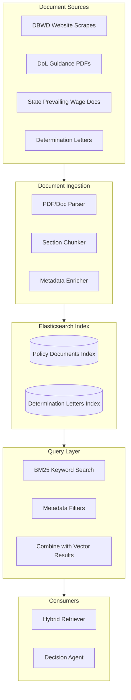

# Search: Policy & Regulatory Documents (Elasticsearch)

Status Label: Designed / Target

Truth anchors:

- [`./INDEX.md`](./INDEX.md)
- [`../foundation/tech-stack-map.md`](../foundation/tech-stack-map.md)
- [`../architecture/retrieval-and-context.md`](../architecture/retrieval-and-context.md)

## Role in the System

Elasticsearch serves as the primary search index for unstructured regulatory content: DBWD policy documents, determination letters, interpretive guidance, and historical agency correspondence. It provides fast keyword and phrase search with BM25 scoring, feeding into the hybrid retrieval pipeline.

## WCP Domain Mapping

| Revenue Intelligence Concept | WCP Compliance Equivalent |
|---|---|
| Call transcripts | DBWD wage determinations and policy documents |
| Speaker identification | Document type and issuing authority |
| Conversation segments | Document sections (summary, wage rates, scope, notes) |
| Topic extraction | Trade classification, locality, effective dates |

## Architecture



## Index Design

### Policy Documents Index

```json
{
  "mappings": {
    "properties": {
      "document_id": { "type": "keyword" },
      "title": { 
        "type": "text", 
        "analyzer": "english",
        "fields": {
          "keyword": { "type": "keyword" }
        }
      },
      "content": { 
        "type": "text", 
        "analyzer": "english" 
      },
      "document_type": { 
        "type": "keyword",
        "fields": {
          "text": { "type": "text" }
        }
      },
      "source_authority": { 
        "type": "keyword" 
      },
      "jurisdiction": { 
        "type": "keyword" 
      },
      "locality_code": { 
        "type": "keyword" 
      },
      "trade_codes": { 
        "type": "keyword" 
      },
      "effective_date": { 
        "type": "date" 
      },
      "expiration_date": { 
        "type": "date" 
      },
      "version": { 
        "type": "keyword" 
      },
      "corpus_version": { 
        "type": "keyword" 
      },
      "ingestion_timestamp": { 
        "type": "date" 
      },
      "chunks": {
        "type": "nested",
        "properties": {
          "chunk_index": { "type": "integer" },
          "section_type": { "type": "keyword" },
          "content": { "type": "text", "analyzer": "english" },
          "start_page": { "type": "integer" }
        }
      }
    }
  },
  "settings": {
    "number_of_shards": 1,
    "number_of_replicas": 1,
    "analysis": {
      "analyzer": {
        "trade_code_analyzer": {
          "tokenizer": "keyword",
          "filter": ["lowercase"]
        }
      }
    }
  }
}
```

### Determination Letters Index

```json
{
  "mappings": {
    "properties": {
      "letter_id": { "type": "keyword" },
      "project_id": { "type": "keyword" },
      "contractor_id": { "type": "keyword" },
      "request_date": { "type": "date" },
      "determination_date": { "type": "date" },
      "status": { "type": "keyword" },
      "trades_affected": { "type": "keyword" },
      "locality": { "type": "keyword" },
      "wage_rates": {
        "type": "nested",
        "properties": {
          "trade": { "type": "keyword" },
          "base_rate": { "type": "float" },
          "fringe": { "type": "float" }
        }
      },
      "full_text": { "type": "text", "analyzer": "english" },
      "interpretation_summary": { "type": "text" }
    }
  }
}
```

## Document Ingestion Pipeline

```typescript
// src/services/elasticsearch/document-ingestion.ts

import { Client } from '@elastic/elasticsearch';
import { z } from 'zod';

/**
 * Schema for document chunk
 */
export const DocumentChunkSchema = z.object({
  chunkIndex: z.number(),
  sectionType: z.enum(['summary', 'wage_rates', 'scope', 'definitions', 'notes']),
  content: z.string(),
  startPage: z.number().optional(),
});

/**
 * Schema for policy document
 */
export const PolicyDocumentSchema = z.object({
  documentId: z.string(),
  title: z.string(),
  content: z.string(),
  documentType: z.enum([
    'dbwd_determination',
    'dol_guidance',
    'state_guidance',
    'interpretation_letter',
    'regulatory_update'
  ]),
  sourceAuthority: z.enum(['DBWD', 'DOL', 'state_agency', 'court']),
  jurisdiction: z.enum(['federal', 'state', 'local']),
  localityCode: z.string().optional(),
  tradeCodes: z.array(z.string()),
  effectiveDate: z.date(),
  expirationDate: z.date().optional(),
  version: z.string(),
  corpusVersion: z.string(),
  chunks: z.array(DocumentChunkSchema),
});

export type PolicyDocument = z.infer<typeof PolicyDocumentSchema>;

export interface DocumentIngestionService {
  /**
   * Index a single policy document with chunking
   */
  indexDocument(doc: PolicyDocument): Promise<void>;
  
  /**
   * Batch index multiple documents
   */
  batchIndex(docs: PolicyDocument[]): Promise<void>;
  
  /**
   * Check if document exists by ID
   */
  documentExists(documentId: string): Promise<boolean>;
  
  /**
   * Delete documents by corpus version (for re-indexing)
   */
  deleteByCorpusVersion(corpusVersion: string): Promise<void>;
}

export class ElasticsearchDocumentIngestionService implements DocumentIngestionService {
  constructor(
    private readonly esClient: Client,
    private readonly indexName: string = 'wcp_policy_documents'
  ) {}

  async indexDocument(doc: PolicyDocument): Promise<void> {
    // Validate document
    const validated = PolicyDocumentSchema.parse(doc);
    
    // Index the main document
    await this.esClient.index({
      index: this.indexName,
      id: validated.documentId,
      document: {
        document_id: validated.documentId,
        title: validated.title,
        content: validated.content,
        document_type: validated.documentType,
        source_authority: validated.sourceAuthority,
        jurisdiction: validated.jurisdiction,
        locality_code: validated.localityCode,
        trade_codes: validated.tradeCodes,
        effective_date: validated.effectiveDate.toISOString(),
        expiration_date: validated.expirationDate?.toISOString(),
        version: validated.version,
        corpus_version: validated.corpusVersion,
        ingestion_timestamp: new Date().toISOString(),
        chunks: validated.chunks.map(c => ({
          chunk_index: c.chunkIndex,
          section_type: c.sectionType,
          content: c.content,
          start_page: c.startPage
        }))
      }
    });
  }

  async batchIndex(docs: PolicyDocument[]): Promise<void> {
    const operations = docs.flatMap(doc => [
      { index: { _index: this.indexName, _id: doc.documentId } },
      {
        document_id: doc.documentId,
        title: doc.title,
        content: doc.content,
        document_type: doc.documentType,
        source_authority: doc.sourceAuthority,
        jurisdiction: doc.jurisdiction,
        locality_code: doc.localityCode,
        trade_codes: doc.tradeCodes,
        effective_date: doc.effectiveDate.toISOString(),
        expiration_date: doc.expirationDate?.toISOString(),
        version: doc.version,
        corpus_version: doc.corpusVersion,
        ingestion_timestamp: new Date().toISOString(),
        chunks: doc.chunks
      }
    ]);

    await this.esClient.bulk({ operations });
  }

  async documentExists(documentId: string): Promise<boolean> {
    const result = await this.esClient.exists({
      index: this.indexName,
      id: documentId
    });
    return result;
  }

  async deleteByCorpusVersion(corpusVersion: string): Promise<void> {
    await this.esClient.deleteByQuery({
      index: this.indexName,
      query: {
        term: { corpus_version: corpusVersion }
      }
    });
  }
}
```

## Search Tool Interface

```typescript
// src/mastra/tools/elasticsearch-tool.ts

import { z } from 'zod';
import { createTool } from '@mastra/core';

/**
 * Schema for search parameters
 */
export const PolicySearchSchema = z.object({
  query: z.string()
    .describe('Search query over policy documents'),
  filters: z.object({
    jurisdiction: z.enum(['federal', 'state', 'local']).optional()
      .describe('Filter by jurisdiction level'),
    localityCode: z.string().optional()
      .describe('Filter by locality (e.g., NY-CITY)'),
    tradeCodes: z.array(z.string()).optional()
      .describe('Filter by specific trade codes'),
    documentTypes: z.array(z.string()).optional()
      .describe('Filter by document types'),
    effectiveAfter: z.date().optional()
      .describe('Only documents effective after this date'),
    effectiveBefore: z.date().optional()
      .describe('Only documents effective before this date'),
  }).optional(),
  size: z.number().int().min(1).max(100).default(10)
    .describe('Number of results to return'),
});

export type PolicySearchInput = z.infer<typeof PolicySearchSchema>;

export interface PolicySearchResult {
  documentId: string;
  title: string;
  documentType: string;
  sourceAuthority: string;
  jurisdiction: string;
  localityCode?: string;
  tradeCodes: string[];
  effectiveDate: string;
  score: number;
  matchedChunks?: {
    sectionType: string;
    content: string;
    highlight?: string;
  }[];
}

export interface PolicySearchOutput {
  results: PolicySearchResult[];
  totalHits: number;
  took: number;
}

/**
 * Tool: searchPolicyDocuments
 * 
 * Searches policy and regulatory documents using BM25.
 * Results feed into the hybrid retriever for reranking.
 */
export const searchPolicyDocumentsTool = createTool({
  id: 'search-policy-documents',
  description: `Search DBWD and regulatory policy documents.
Use this to find wage determinations, guidance, and interpretations
relevant to a specific trade, locality, or compliance question.`,
  inputSchema: PolicySearchSchema,
  execute: async ({ query, filters, size }): Promise<PolicySearchOutput> => {
    // Implementation would query Elasticsearch
    throw new Error('Not implemented - Elasticsearch connection required');
  },
});
```

## Config Example

```bash
# .env

# Elasticsearch configuration
ELASTICSEARCH_NODE=https://your-cluster.es.amazonaws.com:443
ELASTICSEARCH_USERNAME=elastic
ELASTICSEARCH_PASSWORD=secure_password
ELASTICSEARCH_API_KEY=optional_api_key_instead_of_password

# Index names
ELASTICSEARCH_POLICY_INDEX=wcp_policy_documents
ELASTICSEARCH_LETTERS_INDEX=wcp_determination_letters

# Connection settings
ELASTICSEARCH_MAX_RETRIES=3
ELASTICSEARCH_REQUEST_TIMEOUT=30000
ELASTICSEARCH_SNIFF_ON_START=false

# AWS-specific (if using Amazon OpenSearch)
AWS_REGION=us-east-1
AWS_OPENSEARCH_DOMAIN=your-domain
```

## Integration Points

| Existing File | Integration |
|---|---|
| `src/mastra/tools/` | Add `elasticsearch-tool.ts` |
| `src/services/` | Create `elasticsearch/` directory with ingestion service |
| `src/mastra/tools/wcp-tools.ts` | Combine with pgvector results in hybrid retriever |
| `src/config/` | Add Elasticsearch config |

## Trade-offs

| Decision | Rationale |
|---|---|
| **Elasticsearch vs Meilisearch** | Elasticsearch has mature hybrid search, nested document support, and better integration with reranking pipelines. Meilisearch is simpler but less battle-tested at compliance scale. |
| **One index vs split indices** | Split by document type allows different relevance tuning. Single index simplifies queries. Current plan: start unified, split if relevance needs diverge. |
| **Chunk at index vs query time** | Index-time chunking with nested documents allows per-chunk highlighting but adds index complexity. Worth it for citation precision. |
| **BM25 only vs hybrid at ES** | Use ES for BM25 only, combine with pgvector separately. Keeps separation of concerns and allows independent scaling. |

## Implementation Phasing

### Phase 1: Index Setup
- Create index mappings
- Configure analyzers (English + trade code handling)
- Set up corpus versioning

### Phase 2: Ingestion Pipeline
- PDF parsing service
- Document chunking logic
- Batch ingestion from DBWD scrapes

### Phase 3: Search Integration
- `searchPolicyDocuments` tool
- Highlight extraction
- Metadata filter integration

### Phase 4: Hybrid Pipeline
- Combine with pgvector results
- Score normalization
- Cross-encoder reranking integration

## Document Chunking Strategy

For DBWD wage determinations, chunk by logical section:

1. **Summary** - Document header, effective date, scope
2. **Wage Rates** - The actual rate tables (critical for retrieval)
3. **Definitions** - Trade classifications, scope notes
4. **General Notes** - Holiday, overtime, fringe rules
5. **Appendix** - Historical context, modifications

Each chunk gets its own embedding in pgvector but is also searchable in Elasticsearch for keyword hits.
