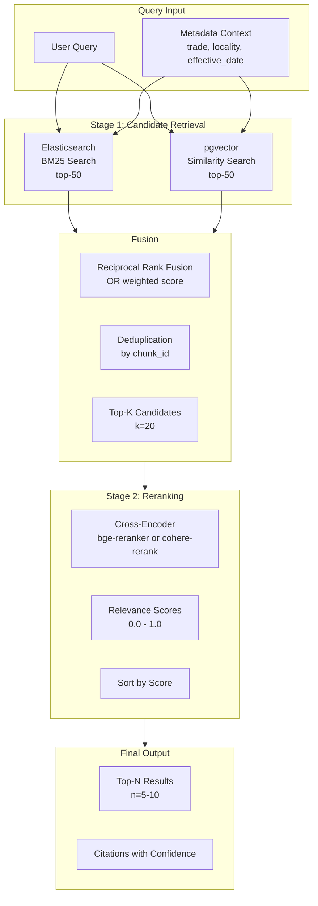

# Retrieval: Hybrid Search + Cross-Encoder Reranking

Status Label: Designed / Target

Truth anchors:

- [`./INDEX.md`](./INDEX.md)
- [`../foundation/tech-stack-map.md`](../foundation/tech-stack-map.md)
- [`../architecture/retrieval-and-context.md`](../architecture/retrieval-and-context.md)
- [`./04-vector-pgvector.md`](./04-vector-pgvector.md)
- [`./02-search-elasticsearch.md`](./02-search-elasticsearch.md)

## Role in the System

The hybrid retriever combines BM25 keyword search (Elasticsearch) with semantic similarity (pgvector), then reranks the fused results using a cross-encoder for final relevance scoring. This two-stage approach balances recall (finding all candidates) with precision (surfacing the best matches).

## WCP Domain Mapping

| Revenue Intelligence Concept | WCP Compliance Equivalent |
|---|---|
| Transcript + CRM data fusion | Policy documents + wage determination fusion |
| Account/opportunity metadata filters | Trade/locality/effective date metadata filters |
| Speaker-based reranking | Section-type weighting (wage_rates > appendix) |
| Conversation relevance | Wage determination relevance for specific worker/role |

## Architecture



## Retrieval Pipeline

```typescript
// src/services/retrieval/hybrid-retriever.ts

import { z } from 'zod';

/**
 * Search query input
 */
export const RetrievalQuerySchema = z.object({
  query: z.string()
    .describe('User search query'),
  context: z.object({
    tradeCode: z.string().optional()
      .describe('Filter to specific trade'),
    localityCode: z.string().optional()
      .describe('Filter to specific locality'),
    effectiveDate: z.date().optional()
      .describe('Effective date for temporal filtering'),
    jurisdiction: z.enum(['federal', 'state', 'local']).optional(),
  }).optional(),
  options: z.object({
    topN: z.number().int().min(1).max(50).default(10)
      .describe('Final number of results to return'),
    candidateMultiplier: z.number().int().min(2).max(10).default(4)
      .describe('Multiplier for candidate pool (candidates = topN * multiplier)'),
    fusionMethod: z.enum(['rrf', 'weighted']).default('rrf')
      .describe('Score fusion method'),
    rrfK: z.number().int().default(60)
      .describe('RRF constant (only for RRF method)'),
  }).default({}),
});

export type RetrievalQuery = z.infer<typeof RetrievalQuerySchema>;

/**
 * Retrieved evidence item
 */
export const RetrievedEvidenceSchema = z.object({
  evidenceId: z.string()
    .describe('Unique ID for this evidence item'),
  chunkId: z.string()
    .describe('Reference to corpus chunk'),
  sourceDocumentId: z.string()
    .describe('Source document identifier'),
  sourceDocumentType: z.enum(['dbwd_determination', 'policy_doc', 'determination_letter']),
  content: z.string()
    .describe('Content text'),
  sectionType: z.enum(['summary', 'wage_rates', 'scope', 'definitions', 'notes', 'appendix']),
  
  // Scores
  bm25Score: z.number().optional()
    .describe('BM25 score from Elasticsearch'),
  vectorSimilarity: z.number().optional()
    .describe('Cosine similarity from pgvector'),
  fusionScore: z.number()
    .describe('Fused score from stage 1'),
  rerankScore: z.number()
    .describe('Cross-encoder rerank score (0-1)'),
  finalScore: z.number()
    .describe('Final ranking score'),
  
  // Metadata
  tradeCodes: z.array(z.string()),
  localityCode: z.string().optional(),
  effectiveDate: z.date(),
  sourceUrl: z.string().optional(),
  pageNumber: z.number().optional(),
  
  // Citations
  citation: z.string()
    .describe('Formatted citation string'),
});

export type RetrievedEvidence = z.infer<typeof RetrievedEvidenceSchema>;

/**
 * Retrieval result
 */
export const RetrievalResultSchema = z.object({
  evidence: z.array(RetrievedEvidenceSchema),
  totalCandidates: z.number().int()
    .describe('Total candidates retrieved in stage 1'),
  query: z.string()
    .describe('Original query'),
  timing: z.object({
    esTimeMs: z.number(),
    pgTimeMs: z.number(),
    fusionTimeMs: z.number(),
    rerankTimeMs: z.number(),
    totalTimeMs: z.number(),
  }),
  corpusVersionId: z.string()
    .describe('Which corpus version was searched'),
});

export type RetrievalResult = z.infer<typeof RetrievalResultSchema>;

export interface HybridRetriever {
  /**
   * Execute full two-stage retrieval pipeline
   */
  retrieve(query: RetrievalQuery): Promise<RetrievalResult>;
  
  /**
   * Stage 1 only: Get fused candidates without reranking
   * (Useful for debugging or lightweight retrieval)
   */
  retrieveCandidates(query: RetrievalQuery): Promise<RetrievedEvidence[]>;
}

export class TwoStageHybridRetriever implements HybridRetriever {
  constructor(
    private readonly esClient: ElasticsearchClient,
    private readonly vectorRepo: VectorRepository,
    private readonly crossEncoder: CrossEncoderReranker,
    private readonly config: {
      esIndex: string;
      defaultCorpusVersion?: string;
    }
  ) {}

  async retrieve(query: RetrievalQuery): Promise<RetrievalResult> {
    const startTime = Date.now();
    const timing: RetrievalResult['timing'] = {
      esTimeMs: 0,
      pgTimeMs: 0,
      fusionTimeMs: 0,
      rerankTimeMs: 0,
      totalTimeMs: 0,
    };
    
    // Stage 1: Retrieve candidates from both sources
    const candidates = await this.retrieveCandidates(query);
    timing.fusionTimeMs = Date.now() - startTime - timing.esTimeMs - timing.pgTimeMs;
    
    // Stage 2: Rerank with cross-encoder
    const rerankStart = Date.now();
    const reranked = await this.rerank(candidates, query.query, query.options?.topN || 10);
    timing.rerankTimeMs = Date.now() - rerankStart;
    
    timing.totalTimeMs = Date.now() - startTime;
    
    return {
      evidence: reranked,
      totalCandidates: candidates.length,
      query: query.query,
      timing,
      corpusVersionId: this.config.defaultCorpusVersion || 'unknown',
    };
  }

  async retrieveCandidates(query: RetrievalQuery): Promise<RetrievedEvidence[]> {
    const candidatePoolSize = (query.options?.topN || 10) * (query.options?.candidateMultiplier || 4);
    
    // Query both sources in parallel
    const [esResults, vectorResults] = await Promise.all([
      this.searchElasticsearch(query, candidatePoolSize),
      this.searchVector(query, candidatePoolSize),
    ]);
    
    // Fuse results
    const fused = this.fuseResults(
      esResults,
      vectorResults,
      query.options?.fusionMethod || 'rrf',
      query.options?.rrfK || 60
    );
    
    // Deduplicate by chunk ID and return top candidates
    return this.deduplicateAndTruncate(fused, candidatePoolSize);
  }

  private async searchElasticsearch(
    query: RetrievalQuery,
    size: number
  ): Promise<Array<{ chunkId: string; score: number; source: 'es' }>> {
    const esQuery = {
      index: this.config.esIndex,
      body: {
        query: {
          bool: {
            must: [
              {
                multi_match: {
                  query: query.query,
                  fields: ['title^3', 'content', 'chunks.content'],
                  type: 'best_fields',
                },
              },
            ],
            filter: this.buildMetadataFilters(query.context),
          },
        },
        size,
      },
    };
    
    const response = await this.esClient.search(esQuery);
    
    return response.hits.hits.map(hit => ({
      chunkId: hit._id,
      score: hit._score || 0,
      source: 'es' as const,
    }));
  }

  private async searchVector(
    query: RetrievalQuery,
    k: number
  ): Promise<Array<{ chunkId: string; score: number; source: 'vector' }>> {
    // Get query embedding
    const embedding = await this.embedQuery(query.query);
    
    // Search vector store
    const results = await this.vectorRepo.search(
      embedding,
      {
        corpusVersionId: this.config.defaultCorpusVersion,
        tradeCodes: query.context?.tradeCode ? [query.context.tradeCode] : undefined,
        localityCode: query.context?.localityCode,
        jurisdiction: query.context?.jurisdiction,
        effectiveAfter: query.context?.effectiveDate,
      },
      k
    );
    
    return results.map(r => ({
      chunkId: r.chunk.chunkId,
      score: r.similarity, // Cosine similarity
      source: 'vector' as const,
    }));
  }

  private buildMetadataFilters(context?: RetrievalQuery['context']): unknown[] {
    const filters: unknown[] = [];
    
    if (context?.jurisdiction) {
      filters.push({ term: { jurisdiction: context.jurisdiction } });
    }
    
    if (context?.localityCode) {
      filters.push({ term: { locality_code: context.localityCode } });
    }
    
    if (context?.tradeCode) {
      filters.push({ terms: { trade_codes: [context.tradeCode] } });
    }
    
    return filters;
  }

  private fuseResults(
    esResults: Array<{ chunkId: string; score: number; source: 'es' }>,
    vectorResults: Array<{ chunkId: string; score: number; source: 'vector' }>,
    method: 'rrf' | 'weighted',
    rrfK: number
  ): Array<{ chunkId: string; fusionScore: number; bm25Score?: number; vectorScore?: number }> {
    const allChunkIds = new Set([
      ...esResults.map(r => r.chunkId),
      ...vectorResults.map(r => r.chunkId),
    ]);
    
    const fused: Array<{ chunkId: string; fusionScore: number; bm25Score?: number; vectorScore?: number }> = [];
    
    for (const chunkId of allChunkIds) {
      const esRank = esResults.findIndex(r => r.chunkId === chunkId);
      const vectorRank = vectorResults.findIndex(r => r.chunkId === chunkId);
      
      let fusionScore: number;
      
      if (method === 'rrf') {
        // Reciprocal Rank Fusion
        const esRRF = esRank >= 0 ? 1 / (rrfK + esRank + 1) : 0;
        const vectorRRF = vectorRank >= 0 ? 1 / (rrfK + vectorRank + 1) : 0;
        fusionScore = esRRF + vectorRRF;
      } else {
        // Weighted score (normalize both to 0-1 first)
        const esMax = Math.max(...esResults.map(r => r.score), 1);
        const vectorMax = Math.max(...vectorResults.map(r => r.score), 1);
        
        const esNorm = esRank >= 0 ? esResults[esRank].score / esMax : 0;
        const vectorNorm = vectorRank >= 0 ? vectorResults[vectorRank].score / vectorMax : 0;
        
        fusionScore = (esNorm * 0.5) + (vectorNorm * 0.5); // Equal weight
      }
      
      fused.push({
        chunkId,
        fusionScore,
        bm25Score: esRank >= 0 ? esResults[esRank].score : undefined,
        vectorScore: vectorRank >= 0 ? vectorResults[vectorRank].score : undefined,
      });
    }
    
    // Sort by fusion score descending
    return fused.sort((a, b) => b.fusionScore - a.fusionScore);
  }

  private deduplicateAndTruncate(
    fused: Array<{ chunkId: string; fusionScore: number; bm25Score?: number; vectorScore?: number }>,
    limit: number
  ): RetrievedEvidence[] {
    // Get full chunk details for top results
    // In production, this would batch fetch from both ES and PG
    // and merge the results
    
    // For now, return placeholder
    return fused.slice(0, limit).map((item, index) => ({
      evidenceId: `ev-${index}`,
      chunkId: item.chunkId,
      sourceDocumentId: 'placeholder',
      sourceDocumentType: 'dbwd_determination',
      content: 'Content would be fetched from corpus',
      sectionType: 'summary',
      bm25Score: item.bm25Score,
      vectorSimilarity: item.vectorScore,
      fusionScore: item.fusionScore,
      rerankScore: 0, // Will be filled in stage 2
      finalScore: 0,
      tradeCodes: [],
      effectiveDate: new Date(),
      citation: 'Placeholder citation',
    }));
  }

  private async rerank(
    candidates: RetrievedEvidence[],
    query: string,
    topN: number
  ): Promise<RetrievedEvidence[]> {
    // Prepare pairs for cross-encoder
    const pairs = candidates.map(c => ({
      query,
      document: c.content,
    }));
    
    // Get rerank scores
    const rerankScores = await this.crossEncoder.rerank(pairs);
    
    // Combine and sort
    const withRerank = candidates.map((c, i) => ({
      ...c,
      rerankScore: rerankScores[i],
      finalScore: this.computeFinalScore(c.fusionScore, rerankScores[i]),
    }));
    
    return withRerank
      .sort((a, b) => b.finalScore - a.finalScore)
      .slice(0, topN);
  }

  private computeFinalScore(fusionScore: number, rerankScore: number): number {
    // Weighted combination: 30% fusion, 70% rerank
    // Rerank is more precise but fusion ensures diversity
    return (fusionScore * 0.3) + (rerankScore * 0.7);
  }

  private async embedQuery(query: string): Promise<number[]> {
    // Use same embedding service as ingestion
    // Implementation would call OpenAI or local embedding model
    throw new Error('Not implemented');
  }
}
```

## Cross-Encoder Reranker

```typescript
// src/services/retrieval/cross-encoder.ts

export interface CrossEncoderReranker {
  /**
   * Rerank document pairs by relevance to query
   * Returns scores 0-1 where 1 is highly relevant
   */
  rerank(pairs: Array<{ query: string; document: string }>): Promise<number[]>;
}

/**
 * HuggingFace Transformers-based cross-encoder
 * Self-hosted option for compliance (data doesn't leave premises)
 */
export class HuggingFaceCrossEncoder implements CrossEncoderReranker {
  constructor(
    private readonly modelName: string = 'BAAI/bge-reranker-base',
    private readonly batchSize: number = 8
  ) {
    // Would initialize transformers pipeline here
  }

  async rerank(pairs: Array<{ query: string; document: string }>): Promise<number[]> {
    // Truncate documents to model max length
    const truncated = pairs.map(p => ({
      query: p.query.slice(0, 512),
      document: p.document.slice(0, 2048),
    }));
    
    // Process in batches
    const scores: number[] = [];
    for (let i = 0; i < truncated.length; i += this.batchSize) {
      const batch = truncated.slice(i, i + this.batchSize);
      const batchScores = await this.scoreBatch(batch);
      scores.push(...batchScores);
    }
    
    // Normalize to 0-1
    const min = Math.min(...scores);
    const max = Math.max(...scores);
    const range = max - min || 1;
    
    return scores.map(s => (s - min) / range);
  }

  private async scoreBatch(batch: Array<{ query: string; document: string }>): Promise<number[]> {
    // Would call transformers pipeline
    // Return placeholder for now
    return batch.map(() => Math.random());
  }
}

/**
 * Cohere reranker API
 * Managed service option (simpler, but data leaves premises)
 */
export class CohereReranker implements CrossEncoderReranker {
  constructor(
    private readonly apiKey: string,
    private readonly model: string = 'rerank-english-v2.0'
  ) {}

  async rerank(pairs: Array<{ query: string; document: string }>): Promise<number[]> {
    const response = await fetch('https://api.cohere.com/v1/rerank', {
      method: 'POST',
      headers: {
        'Authorization': `Bearer ${this.apiKey}`,
        'Content-Type': 'application/json',
      },
      body: JSON.stringify({
        query: pairs[0].query, // Cohere API takes single query
        documents: pairs.map(p => p.document),
        model: this.model,
        top_n: pairs.length,
      }),
    });
    
    const result = await response.json();
    
    // Map results back to original order
    return pairs.map((_, i) => {
      const rerankResult = result.results.find((r: { index: number }) => r.index === i);
      return rerankResult?.relevance_score || 0;
    });
  }
}
```

## Tool Interface

```typescript
// src/mastra/tools/retrieval-tool.ts

import { z } from 'zod';
import { createTool } from '@mastra/core';

export const RetrieveEvidenceSchema = z.object({
  query: z.string()
    .describe('Evidence search query'),
  tradeCode: z.string().optional()
    .describe('Worker trade code for filtering'),
  localityCode: z.string().optional()
    .describe('Project locality code'),
  effectiveDate: z.string().datetime().optional()
    .describe('Date for temporal filtering (ISO 8601)'),
  topN: z.number().int().min(1).max(20).default(5)
    .describe('Number of evidence items to retrieve'),
});

export type RetrieveEvidenceInput = z.infer<typeof RetrieveEvidenceSchema>;

/**
 * Tool: retrieveEvidence
 * 
 * Two-stage hybrid retrieval over wage and policy corpus.
 * Returns cited evidence ranked by relevance.
 */
export const retrieveEvidenceTool = createTool({
  id: 'retrieve-evidence',
  description: `Retrieve authoritative wage and policy evidence.
Use this to find DBWD determinations and policy documents 
relevant to a specific worker, trade, and locality.`,
  inputSchema: RetrieveEvidenceSchema,
  execute: async ({ query, tradeCode, localityCode, effectiveDate, topN }): Promise<RetrievalResult> => {
    // Implementation would:
    // 1. Call HybridRetriever.retrieve()
    // 2. Return structured results with citations
    throw new Error('Not implemented - retrieval pipeline required');
  },
});
```

## Config Example

```bash
# .env

# Fusion settings
RETRIEVAL_FUSION_METHOD=rrf
RETRIEVAL_RRF_K=60
RETRIEVAL_DEFAULT_TOP_N=10
RETRIEVAL_CANDIDATE_MULTIPLIER=4

# Cross-encoder
RERANKER_TYPE=huggingface  # or 'cohere'
RERANKER_MODEL=BAAI/bge-reranker-base
COHERE_API_KEY=  # only if using cohere

# Score weights
RERANK_FUSION_WEIGHT=0.3
RERANK_CROSS_ENCODER_WEIGHT=0.7

# Section type boosting (optional)
BOOST_WAGE_RATES=1.5
BOOST_SUMMARY=1.2
BOOST_DEFINITIONS=1.0
BOOST_NOTES=0.8
BOOST_APPENDIX=0.5
```

## Integration Points

| Existing File | Integration |
|---|---|
| `src/services/retrieval/` | New directory with hybrid retriever |
| `src/mastra/tools/` | Add `retrieval-tool.ts` |
| `src/mastra/agents/wcp-agent.ts` | Agent calls retrieval tool for evidence |
| `src/entrypoints/wcp-entrypoint.ts` | Orchestrates retrieval → decision flow |

## Trade-offs

| Decision | Rationale |
|---|---|
| **RRF vs Weighted fusion** | RRF doesn't require score normalization and handles missing sources gracefully. Weighted fusion requires calibrating score ranges but allows explicit tuning. Start with RRF. |
| **Cross-encoder vs MonoT5** | Cross-encoders (bge-reranker) are simpler to deploy and sufficient for this scale. MonoT5 is more flexible but adds complexity. |
| **Self-hosted vs API reranker** | Self-hosted (HuggingFace) keeps wage data in premises (compliance benefit). API (Cohere) is simpler but sends data externally. |
| **Candidate pool size** | 4x multiplier (40 candidates for top-10) balances recall with reranker latency. Too few candidates risk missing good matches; too many wastes compute. |

## Implementation Phasing

### Phase 1: Stage 1 (Candidate Retrieval)
- Elasticsearch integration for BM25
- pgvector integration for semantic search
- RRF fusion implementation
- Metadata filtering

### Phase 2: Stage 2 (Reranking)
- Cross-encoder integration
- Batch scoring optimization
- Score calibration

### Phase 3: Optimization
- Caching of query embeddings
- Parallel fusion and reranking
- Latency monitoring

## Performance Targets

| Metric | Target | Notes |
|---|---|---|
| Stage 1 latency (ES + PG) | <200ms | Parallel queries |
| Fusion time | <10ms | In-memory operation |
| Cross-encoder latency | <500ms | Batch 40 documents |
| End-to-end retrieval | <800ms | Total pipeline |
| Recall@20 | >90% | Ground truth evaluation |
| NDCG@5 | >0.8 | After reranking |
