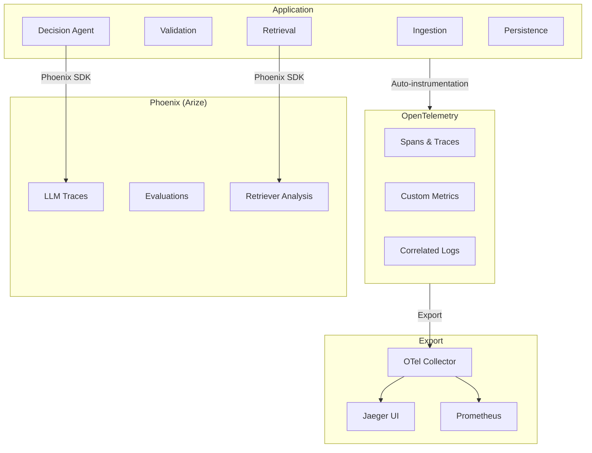

# Observability: OpenTelemetry + Phoenix Tracing

Status Label: Designed / Target

Truth anchors:

- [`./INDEX.md`](./INDEX.md)
- [`../foundation/tech-stack-map.md`](../foundation/tech-stack-map.md)
- [`../architecture/observability-and-operations.md`](../architecture/observability-and-operations.md)
- [`../../src/instrumentation.ts`](../../src/instrumentation.ts)

## Role in the System

OpenTelemetry provides distributed tracing across the entire decision pipeline, enabling latency analysis, bottleneck detection, and debugging. Phoenix (Arize) adds LLM-specific trace inspection for understanding model behavior, prompt effectiveness, and retrieval quality.

## WCP Domain Mapping

| Revenue Intelligence Concept | WCP Compliance Equivalent |
|---|---|
| Call transcript analysis | WCP document processing trace |
| Rep/opp deal flow trace | Submission → validation → retrieval → decision trace |
| Conversation turn tracking | Decision reasoning step tracking |
| Topic shift detection | Finding type progression in decision |

## Architecture



## Instrumentation Setup

### OpenTelemetry Configuration

```typescript
// src/instrumentation.ts (enhanced)

import { NodeSDK } from '@opentelemetry/sdk-node';
import { getNodeAutoInstrumentations } from '@opentelemetry/auto-instrumentations-node';
import { OTLPTraceExporter } from '@opentelemetry/exporter-trace-otlp-http';
import { OTLPMetricExporter } from '@opentelemetry/exporter-metrics-otlp-http';
import { PeriodicExportingMetricReader } from '@opentelemetry/sdk-metrics';
import { Resource } from '@opentelemetry/resources';
import { SemanticResourceAttributes } from '@opentelemetry/semantic-conventions';
import { registerInstrumentations } from '@opentelemetry/instrumentation';
import { WcpSpanProcessor } from './observability/wcp-span-processor';

/**
 * Initialize OpenTelemetry with WCP-specific configuration
 */
export function initInstrumentation(): void {
  const resource = new Resource({
    [SemanticResourceAttributes.SERVICE_NAME]: 'wcp-compliance-agent',
    [SemanticResourceAttributes.SERVICE_VERSION]: process.env.npm_package_version || '0.1.0',
    [SemanticResourceAttributes.DEPLOYMENT_ENVIRONMENT]: process.env.NODE_ENV || 'development',
    'wcp.domain': 'compliance',
  });

  const traceExporter = new OTLPTraceExporter({
    url: process.env.OTEL_EXPORTER_OTLP_ENDPOINT || 'http://localhost:4318/v1/traces',
  });

  const metricExporter = new OTLPMetricExporter({
    url: process.env.OTEL_EXPORTER_OTLP_METRICS_ENDPOINT || 'http://localhost:4318/v1/metrics',
  });

  const sdk = new NodeSDK({
    resource,
    traceExporter,
    metricReader: new PeriodicExportingMetricReader({
      exporter: metricExporter,
      exportIntervalMillis: 60000,
    }),
    instrumentations: [
      getNodeAutoInstrumentations({
        '@opentelemetry/instrumentation-fs': { enabled: false },
      }),
    ],
    spanProcessors: [
      new WcpSpanProcessor(), // Custom span enrichment
    ],
  });

  sdk.start();

  // Graceful shutdown
  process.on('SIGTERM', () => {
    sdk.shutdown()
      .then(() => console.log('OpenTelemetry SDK shut down'))
      .catch(err => console.error('Error shutting down OpenTelemetry SDK', err));
  });
}
```

### Custom Span Processor

```typescript
// src/observability/wcp-span-processor.ts

import { SpanProcessor, ReadableSpan, Span } from '@opentelemetry/sdk-trace-base';
import { Context } from '@opentelemetry/api';

/**
 * Custom span processor that enriches WCP-specific attributes
 */
export class WcpSpanProcessor implements SpanProcessor {
  onStart(span: Span, parentContext: Context): void {
    // Add common attributes to all spans
    span.setAttribute('wcp.trace_version', '1.0');
    
    // Add correlation IDs if present in context
    const submissionId = parentContext.getValue(Symbol.for('submissionId'));
    if (submissionId) {
      span.setAttribute('wcp.submission_id', submissionId as string);
    }
    
    const decisionId = parentContext.getValue(Symbol.for('decisionId'));
    if (decisionId) {
      span.setAttribute('wcp.decision_id', decisionId as string);
    }
    
    const contractorId = parentContext.getValue(Symbol.for('contractorId'));
    if (contractorId) {
      span.setAttribute('wcp.contractor_id', contractorId as string);
    }
  }

  onEnd(span: ReadableSpan): void {
    // No-op for now - could add filtering or sampling here
  }

  shutdown(): Promise<void> {
    return Promise.resolve();
  }

  forceFlush(): Promise<void> {
    return Promise.resolve();
  }
}
```

## Custom Instrumentation

### Entrypoint Instrumentation

```typescript
// src/entrypoints/wcp-entrypoint.ts (with tracing)

import { trace, SpanStatusCode } from '@opentelemetry/api';
import { z } from 'zod';

const tracer = trace.getTracer('wcp-compliance-agent', '0.1.0');

export interface DecisionContext {
  submissionId: string;
  contractorId: string;
  projectId: string;
  // ... other context
}

export async function generateWcpDecision(
  payload: unknown,
  context: DecisionContext
): Promise<WcpDecisionResult> {
  return tracer.startActiveSpan('generate-wcp-decision', async (span) => {
    try {
      // Set context attributes on span
      span.setAttribute('wcp.submission_id', context.submissionId);
      span.setAttribute('wcp.contractor_id', context.contractorId);
      span.setAttribute('wcp.project_id', context.projectId);
      
      // Phase 1: Parse and validate
      const parseResult = await tracer.startActiveSpan('phase-1-parse-validate', async (phaseSpan) => {
        try {
          const result = await parseAndValidate(payload);
          phaseSpan.setAttribute('wcp.validation_errors', result.errors.length);
          phaseSpan.setAttribute('wcp.validation_warnings', result.warnings.length);
          return result;
        } catch (error) {
          phaseSpan.setStatus({ code: SpanStatusCode.ERROR, message: String(error) });
          throw error;
        } finally {
          phaseSpan.end();
        }
      });
      
      // Phase 2: Retrieve evidence
      const evidence = await tracer.startActiveSpan('phase-2-retrieve-evidence', async (phaseSpan) => {
        try {
          const result = await retrieveEvidence({
            query: buildEvidenceQuery(parseResult),
            tradeCode: parseResult.tradeCode,
            localityCode: parseResult.localityCode,
          });
          phaseSpan.setAttribute('wcp.evidence_items', result.evidence.length);
          phaseSpan.setAttribute('wcp.retrieval_latency_ms', result.timing.totalTimeMs);
          return result;
        } catch (error) {
          phaseSpan.setStatus({ code: SpanStatusCode.ERROR, message: String(error) });
          throw error;
        } finally {
          phaseSpan.end();
        }
      });
      
      // Phase 3: Decision synthesis
      const decision = await tracer.startActiveSpan('phase-3-decision-synthesis', async (phaseSpan) => {
        try {
          const result = await synthesizeDecision({
            validation: parseResult,
            evidence: evidence.evidence,
          });
          phaseSpan.setAttribute('wcp.decision_outcome', result.outcome);
          phaseSpan.setAttribute('wcp.decision_confidence', result.confidence);
          phaseSpan.setAttribute('wcp.llm_tokens_used', result.metadata.tokensUsed);
          return result;
        } catch (error) {
          phaseSpan.setStatus({ code: SpanStatusCode.ERROR, message: String(error) });
          throw error;
        } finally {
          phaseSpan.end();
        }
      });
      
      // Phase 4: Persist
      await tracer.startActiveSpan('phase-4-persist', async (phaseSpan) => {
        try {
          await persistDecision(decision, context);
          phaseSpan.setAttribute('wcp.persistence_success', true);
        } catch (error) {
          phaseSpan.setStatus({ code: SpanStatusCode.ERROR, message: String(error) });
          phaseSpan.setAttribute('wcp.persistence_success', false);
          throw error;
        } finally {
          phaseSpan.end();
        }
      });
      
      span.setStatus({ code: SpanStatusCode.OK });
      return decision;
      
    } catch (error) {
      span.setStatus({ code: SpanStatusCode.ERROR, message: String(error) });
      span.recordException(error as Error);
      throw error;
    } finally {
      span.end();
    }
  });
}
```

### Tool Instrumentation

```typescript
// src/observability/tool-instrumentation.ts

import { trace, SpanStatusCode } from '@opentelemetry/api';
import { createTool } from '@mastra/core';

const tracer = trace.getTracer('wcp-tools', '0.1.0');

/**
 * Decorator/wrapper to add tracing to any Mastra tool
 */
export function withTracing<TInput, TOutput>(
  toolId: string,
  execute: (input: TInput) => Promise<TOutput>
): (input: TInput) => Promise<TOutput> {
  return async (input: TInput): Promise<TOutput> => {
    return tracer.startActiveSpan(`tool:${toolId}`, async (span) => {
      try {
        span.setAttribute('wcp.tool_id', toolId);
        span.setAttribute('wcp.tool_input_size', JSON.stringify(input).length);
        
        const startTime = Date.now();
        const result = await execute(input);
        const duration = Date.now() - startTime;
        
        span.setAttribute('wcp.tool_duration_ms', duration);
        span.setAttribute('wcp.tool_output_size', JSON.stringify(result).length);
        span.setStatus({ code: SpanStatusCode.OK });
        
        return result;
      } catch (error) {
        span.setStatus({ code: SpanStatusCode.ERROR, message: String(error) });
        span.recordException(error as Error);
        throw error;
      } finally {
        span.end();
      }
    });
  };
}
```

## Phoenix Integration

### Phoenix Setup

```typescript
// src/observability/phoenix-client.ts

import { arizePhoenix } from '@arize/phoenix-client';

/**
 * Phoenix client for LLM trace inspection
 */
export class PhoenixClient {
  private client: ReturnType<typeof arizePhoenix>;
  
  constructor(
    endpoint: string = process.env.PHOENIX_ENDPOINT || 'http://localhost:6006',
    apiKey?: string
  ) {
    this.client = arizePhoenix({
      endpoint,
      apiKey,
    });
  }
  
  /**
   * Log LLM span to Phoenix
   */
  async logLlmSpan(params: {
    traceId: string;
    spanId: string;
    parentSpanId?: string;
    name: string;
    startTime: Date;
    endTime: Date;
    model: string;
    input: unknown;
    output: unknown;
    tokenCount: {
      prompt: number;
      completion: number;
      total: number;
    };
    metadata?: Record<string, unknown>;
  }): Promise<void> {
    await this.client.logSpan({
      project_name: 'wcp-compliance',
      trace_id: params.traceId,
      span_id: params.spanId,
      parent_id: params.parentSpanId,
      span_kind: 'LLM',
      name: params.name,
      start_time: params.startTime.toISOString(),
      end_time: params.endTime.toISOString(),
      attributes: {
        'llm.model_name': params.model,
        'llm.token_count.prompt': params.tokenCount.prompt,
        'llm.token_count.completion': params.tokenCount.completion,
        'llm.token_count.total': params.tokenCount.total,
        ...params.metadata,
      },
      input: JSON.stringify(params.input),
      output: JSON.stringify(params.output),
    });
  }
  
  /**
   * Log retriever span to Phoenix
   */
  async logRetrieverSpan(params: {
    traceId: string;
    spanId: string;
    parentSpanId?: string;
    query: string;
    results: Array<{
      documentId: string;
      content: string;
      score: number;
    }>;
    metadata?: Record<string, unknown>;
  }): Promise<void> {
    await this.client.logSpan({
      project_name: 'wcp-compliance',
      trace_id: params.traceId,
      span_id: params.spanId,
      parent_id: params.parentSpanId,
      span_kind: 'RETRIEVER',
      name: 'retrieve-evidence',
      attributes: {
        'retrieval.query': params.query,
        'retrieval.num_results': params.results.length,
        ...params.metadata,
      },
      input: params.query,
      output: JSON.stringify(params.results.map(r => ({
        document_id: r.documentId,
        score: r.score,
      }))),
    });
  }
}

/**
 * Singleton Phoenix client instance
 */
let phoenixClient: PhoenixClient | null = null;

export function getPhoenixClient(): PhoenixClient {
  if (!phoenixClient) {
    phoenixClient = new PhoenixClient();
  }
  return phoenixClient;
}
```

### Decision Agent with Phoenix

```typescript
// src/mastra/agents/wcp-agent.ts (with Phoenix tracing)

import { getPhoenixClient } from '../../observability/phoenix-client';
import { trace } from '@opentelemetry/api';

const phoenix = getPhoenixClient();
const tracer = trace.getTracer('wcp-agent', '0.1.0');

export async function synthesizeDecision(params: {
  validation: ValidationResult;
  evidence: RetrievedEvidence[];
}): Promise<DecisionResult> {
  const traceId = generateTraceId();
  const spanId = generateSpanId();
  const startTime = new Date();
  
  try {
    // Get LLM response (existing logic)
    const response = await callLlm({
      model: 'gpt-4',
      prompt: buildDecisionPrompt(params),
    });
    
    const endTime = new Date();
    
    // Log to Phoenix
    await phoenix.logLlmSpan({
      traceId,
      spanId,
      name: 'decision-synthesis',
      startTime,
      endTime,
      model: 'gpt-4',
      input: { prompt: buildDecisionPrompt(params) },
      output: response,
      tokenCount: response.usage,
      metadata: {
        'wcp.evidence_count': params.evidence.length,
        'wcp.validation_errors': params.validation.errors.length,
      },
    });
    
    return parseDecisionResponse(response);
    
  } catch (error) {
    // Log error to Phoenix
    await phoenix.logLlmSpan({
      traceId,
      spanId,
      name: 'decision-synthesis',
      startTime,
      endTime: new Date(),
      model: 'gpt-4',
      input: { prompt: buildDecisionPrompt(params) },
      output: { error: String(error) },
      tokenCount: { prompt: 0, completion: 0, total: 0 },
      metadata: { error: true, error_message: String(error) },
    });
    throw error;
  }
}
```

## Custom Metrics

```typescript
// src/observability/metrics.ts

import { metrics, Counter, Histogram, UpDownCounter } from '@opentelemetry/api';

const meter = metrics.getMeter('wcp-compliance', '0.1.0');

/**
 * Custom metrics for compliance monitoring
 */
export const wcpMetrics = {
  // Decision outcomes
  decisionsTotal: meter.createCounter('wcp.decisions.total', {
    description: 'Total number of decisions made',
  }),
  
  decisionsByOutcome: meter.createCounter('wcp.decisions.by_outcome', {
    description: 'Decisions by outcome (approved, rejected, deferred)',
  }),
  
  // Confidence distribution
  confidenceHistogram: meter.createHistogram('wcp.decision.confidence', {
    description: 'Decision confidence score distribution',
    unit: 'score',
    advice: {
      explicitBucketBoundaries: [0.0, 0.5, 0.7, 0.8, 0.9, 0.95, 1.0],
    },
  }),
  
  // Latency
  decisionLatency: meter.createHistogram('wcp.decision.latency', {
    description: 'End-to-end decision latency',
    unit: 'ms',
    advice: {
      explicitBucketBoundaries: [100, 250, 500, 1000, 2000, 5000, 10000],
    },
  }),
  
  // Retrieval
  retrievalLatency: meter.createHistogram('wcp.retrieval.latency', {
    description: 'Evidence retrieval latency',
    unit: 'ms',
  }),
  
  retrievalHitRate: meter.createHistogram('wcp.retrieval.hit_rate', {
    description: 'Retrieval hit rate (results found)',
    unit: 'ratio',
  }),
  
  // Validation
  validationErrors: meter.createCounter('wcp.validation.errors', {
    description: 'Validation errors by type',
  }),
  
  // Token usage
  tokensUsed: meter.createCounter('wcp.tokens.used', {
    description: 'Total tokens used by model and step',
  }),
  
  // Cost
  costPerDecision: meter.createHistogram('wcp.cost.per_decision', {
    description: 'Cost per decision in USD',
    unit: 'USD',
  }),
  
  // Active contexts (gauge)
  activeDecisions: meter.createUpDownCounter('wcp.decisions.active', {
    description: 'Number of decisions currently in progress',
  }),
};

// Helper to record decision metrics
export function recordDecisionMetrics(decision: DecisionResult, latencyMs: number): void {
  wcpMetrics.decisionsTotal.add(1);
  wcpMetrics.decisionsByOutcome.add(1, { outcome: decision.outcome });
  wcpMetrics.confidenceHistogram.record(decision.confidence);
  wcpMetrics.decisionLatency.record(latencyMs);
  wcpMetrics.tokensUsed.add(decision.metadata.tokensUsed, { step: 'synthesis' });
  wcpMetrics.costPerDecision.record(decision.metadata.estimatedCostUsd);
}
```

## Config Example

```bash
# .env

# OpenTelemetry
OTEL_EXPORTER_OTLP_ENDPOINT=http://localhost:4318
OTEL_EXPORTER_OTLP_TRACES_ENDPOINT=http://localhost:4318/v1/traces
OTEL_EXPORTER_OTLP_METRICS_ENDPOINT=http://localhost:4318/v1/metrics
OTEL_SERVICE_NAME=wcp-compliance-agent
OTEL_SERVICE_VERSION=0.1.0
OTEL_LOG_LEVEL=info

# Sampling (production: use probabilistic)
OTEL_TRACES_SAMPLER=parentbased_traceidratio
OTEL_TRACES_SAMPLER_ARG=0.1

# Phoenix (Arize)
PHOENIX_ENDPOINT=http://localhost:6006
PHOENIX_API_KEY=optional_api_key_for_cloud
PHOENIX_PROJECT_NAME=wcp-compliance

# Jaeger (alternative trace viewer)
JAEGER_ENDPOINT=http://localhost:16686

# Prometheus scraping
PROMETHEUS_PORT=9090
```

## Integration Points

| Existing File | Integration |
|---|---|
| `src/instrumentation.ts` | Enhanced OTel setup |
| `src/index.ts` | Initialize instrumentation on startup |
| `src/entrypoints/wcp-entrypoint.ts` | Add decision pipeline tracing |
| `src/mastra/agents/wcp-agent.ts` | LLM spans to Phoenix |
| `src/mastra/tools/` | Tool execution tracing |
| `src/observability/` | New directory with all observability code |

## Trade-offs

| Decision | Rationale |
|---|---|
| **OTel + Phoenix vs LangSmith/Langfuse** | OTel is vendor-neutral and works with any backend. Phoenix is open-source and can be self-hosted (compliance benefit). LangSmith/Langfuse are easier but vendor-dependent. |
| **Auto-instrumentation vs manual** | Auto-instrumentation for HTTP/DB, manual for business logic spans. Balance of coverage and control. |
| **Trace sampling** | 100% in dev/staging for debugging, 10% in production for cost. Critical decisions can force sample. |
| **Span size limits** | Large evidence content shouldn't be in spans. Use trace IDs to correlate with decision store instead. |

## Implementation Phasing

### Phase 1: Basic Tracing
- OTel SDK setup with auto-instrumentation
- HTTP and database spans
- Custom span processor for correlation IDs

### Phase 2: Business Logic Tracing
- Decision pipeline spans (4 phases)
- Tool execution tracing
- Error recording

### Phase 3: LLM-Specific Observability
- Phoenix integration
- LLM span logging
- Retriever span logging

### Phase 4: Metrics
- Custom business metrics
- Dashboards (Grafana)
- Alerting rules

## Dashboards

### Decision Pipeline Dashboard

| Panel | Query |
|---|---|
| Decision rate | `rate(wcp_decisions_total[5m])` |
| Outcome distribution | `wcp_decisions_by_outcome` by outcome label |
| P95 latency | `histogram_quantile(0.95, rate(wcp_decision_latency_bucket[5m]))` |
| Retrieval latency | `histogram_quantile(0.95, rate(wcp_retrieval_latency_bucket[5m]))` |
| Token usage | `rate(wcp_tokens_used[5m])` by model and step |
| Cost per decision | `avg(wcp_cost_per_decision)` |

### Phoenix Traces

- Trace by submission ID
- Compare prompt versions
- Retrieval result quality
- LLM response patterns

## Alerting Rules

```yaml
# Example Prometheus alerting rules

- alert: HighDecisionLatency
  expr: histogram_quantile(0.99, wcp_decision_latency_bucket) > 5000
  for: 5m
  annotations:
    summary: "Decision latency P99 > 5s"
    
- alert: HighErrorRate
  expr: rate(wcp_decisions_total{outcome="error"}[5m]) / rate(wcp_decisions_total[5m]) > 0.05
  for: 5m
  annotations:
    summary: "Decision error rate > 5%"
    
- alert: LowConfidenceDecisions
  expr: rate(wcp_decisions_total{confidence="low"}[1h]) > 10
  annotations:
    summary: "Multiple low-confidence decisions - review threshold"
```
