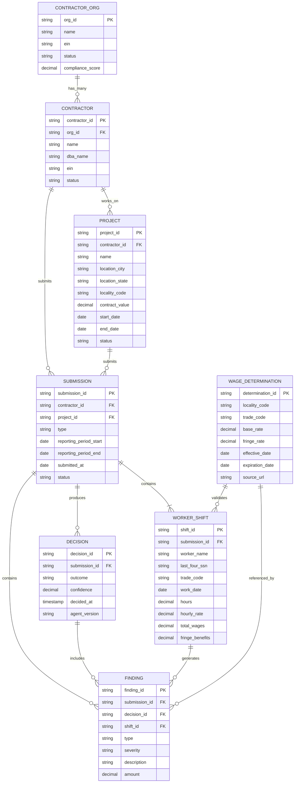

# Entity Data Model: Compliance Domain Abstractions

Status Label: Designed / Target

Truth anchors:

- [`./INDEX.md`](./INDEX.md)
- [`../foundation/tech-stack-map.md`](../foundation/tech-stack-map.md)
- [`../architecture/data-model.md`](../architecture/data-model.md)
- [`../architecture/system-overview.md`](../architecture/system-overview.md)

## Role in the System

Entity abstractions define the core domain model for the WCP Compliance Agent: contractors, projects, submissions, worker shifts, wage determinations, findings, and decisions. These entities map to SQL tables today with a path to graph-based relationships for future behavioral analysis.

## WCP Domain Mapping

| Revenue Intelligence Concept | WCP Compliance Equivalent |
|---|---|
| **Rep** (sales representative) | **Contractor** (employer submitting WCPs) |
| **Call** (customer interaction) | **Submission** (weekly/monthly payroll report) |
| **Opportunity** (potential deal) | **Project** (construction project under Davis-Bacon) |
| **Moment** (conversation segment) | **WorkerShift** (individual worker's reported hours/wages) |
| **Account** (customer org) | **ContractorOrg** (contractor organization/company) |

## Architecture



## SQL Schema

### Core Entities

```sql
-- Contractor Organization (parent entity)
CREATE TABLE contractor_orgs (
    org_id VARCHAR(100) PRIMARY KEY,
    name VARCHAR(255) NOT NULL,
    legal_name VARCHAR(255),
    ein VARCHAR(20) UNIQUE,
    
    -- Status
    status VARCHAR(20) DEFAULT 'active' 
        CHECK (status IN ('active', 'suspended', 'inactive')),
    
    -- Address
    address_street VARCHAR(255),
    address_city VARCHAR(100),
    address_state VARCHAR(2),
    address_zip VARCHAR(20),
    
    -- Contact
    primary_contact_name VARCHAR(255),
    primary_contact_email VARCHAR(255),
    primary_contact_phone VARCHAR(50),
    
    -- Compliance tracking
    compliance_score DECIMAL(5, 2) CHECK (compliance_score >= 0 AND compliance_score <= 100),
    last_submission_date DATE,
    total_submissions INT DEFAULT 0,
    violation_count_12m INT DEFAULT 0,
    
    -- Timestamps
    created_at TIMESTAMP DEFAULT CURRENT_TIMESTAMP,
    updated_at TIMESTAMP DEFAULT CURRENT_TIMESTAMP,
    
    -- Soft delete
    deleted_at TIMESTAMP
);

CREATE INDEX idx_contractor_orgs_ein ON contractor_orgs(ein);
CREATE INDEX idx_contractor_orgs_status ON contractor_orgs(status);

-- Contractor (can be individual or company)
CREATE TABLE contractors (
    contractor_id VARCHAR(100) PRIMARY KEY,
    org_id VARCHAR(100) NOT NULL REFERENCES contractor_orgs(org_id),
    
    -- Identity
    name VARCHAR(255) NOT NULL,
    dba_name VARCHAR(255), -- "Doing Business As"
    ein VARCHAR(20),
    
    -- Classification
    business_type VARCHAR(50) CHECK (business_type IN (
        'sole_proprietorship', 'partnership', 'llc', 'corporation', 
        's_corporation', 'non_profit', 'government'
    )),
    
    -- Status
    status VARCHAR(20) DEFAULT 'active' 
        CHECK (status IN ('active', 'suspended', 'debarred', 'inactive')),
    registration_date DATE,
    
    -- Metadata
    created_at TIMESTAMP DEFAULT CURRENT_TIMESTAMP,
    updated_at TIMESTAMP DEFAULT CURRENT_TIMESTAMP,
    
    UNIQUE(org_id, ein)
);

CREATE INDEX idx_contractors_org ON contractors(org_id);
CREATE INDEX idx_contractors_ein ON contractors(ein);
CREATE INDEX idx_contractors_status ON contractors(status);

-- Project (Davis-Bacon covered project)
CREATE TABLE projects (
    project_id VARCHAR(100) PRIMARY KEY,
    contractor_id VARCHAR(100) NOT NULL REFERENCES contractors(contractor_id),
    
    -- Basic info
    name VARCHAR(255) NOT NULL,
    description TEXT,
    
    -- Location (determines prevailing wage locality)
    location_street VARCHAR(255),
    location_city VARCHAR(100) NOT NULL,
    location_state VARCHAR(2) NOT NULL,
    location_zip VARCHAR(20),
    locality_code VARCHAR(50) NOT NULL, -- DBWD locality identifier
    
    -- Contract details
    contract_number VARCHAR(100),
    contract_value DECIMAL(15, 2),
    funding_type VARCHAR(50) CHECK (funding_type IN (
        'federal', 'state', 'local', 'federal_state', 'private'
    )),
    
    -- Timeline
    start_date DATE,
    end_date DATE,
    status VARCHAR(20) DEFAULT 'active' 
        CHECK (status IN ('active', 'completed', 'cancelled')),
    
    -- Wage determination reference
    wage_determination_id VARCHAR(100),
    
    -- Trades on this project
    trades_required TEXT[],
    
    -- Timestamps
    created_at TIMESTAMP DEFAULT CURRENT_TIMESTAMP,
    updated_at TIMESTAMP DEFAULT CURRENT_TIMESTAMP
);

CREATE INDEX idx_projects_contractor ON projects(contractor_id);
CREATE INDEX idx_projects_locality ON projects(locality_code);
CREATE INDEX idx_projects_status ON projects(status);

-- Submission (Weekly Certified Payroll)
CREATE TABLE submissions (
    submission_id VARCHAR(100) PRIMARY KEY,
    contractor_id VARCHAR(100) NOT NULL REFERENCES contractors(contractor_id),
    project_id VARCHAR(100) NOT NULL REFERENCES projects(project_id),
    
    -- Submission type
    type VARCHAR(20) NOT NULL 
        CHECK (type IN ('weekly', 'biweekly', 'monthly', 'final', 'amendment')),
    amendment_of_submission_id VARCHAR(100) REFERENCES submissions(submission_id),
    
    -- Reporting period
    reporting_period_start DATE NOT NULL,
    reporting_period_end DATE NOT NULL,
    
    -- Submission metadata
    submitted_at TIMESTAMP DEFAULT CURRENT_TIMESTAMP,
    submitted_by VARCHAR(255),
    submission_method VARCHAR(50) CHECK (submission_method IN (
        'web_portal', 'email', 'api', 'paper'
    )),
    
    -- Document references
    document_urls TEXT[],
    original_filename VARCHAR(255),
    
    -- Processing status
    status VARCHAR(20) DEFAULT 'pending' 
        CHECK (status IN ('pending', 'processing', 'decided', 'appealed', 'resolved')),
    
    -- Decision reference (set after processing)
    decision_id VARCHAR(100),
    
    -- Aggregates (from worker shifts)
    total_workers INT,
    total_hours DECIMAL(10, 2),
    total_wages DECIMAL(15, 2),
    total_fringe DECIMAL(15, 2),
    
    -- Timestamps
    created_at TIMESTAMP DEFAULT CURRENT_TIMESTAMP,
    updated_at TIMESTAMP DEFAULT CURRENT_TIMESTAMP
);

CREATE INDEX idx_submissions_contractor ON submissions(contractor_id);
CREATE INDEX idx_submissions_project ON submissions(project_id);
CREATE INDEX idx_submissions_period ON submissions(reporting_period_start, reporting_period_end);
CREATE INDEX idx_submissions_status ON submissions(status);
CREATE INDEX idx_submissions_decision ON submissions(decision_id);

-- Worker Shift (individual line item from payroll)
CREATE TABLE worker_shifts (
    shift_id VARCHAR(100) PRIMARY KEY,
    submission_id VARCHAR(100) NOT NULL REFERENCES submissions(submission_id),
    
    -- Worker identification
    worker_name VARCHAR(255) NOT NULL,
    last_four_ssn VARCHAR(4), -- Privacy: only last 4
    worker_classification VARCHAR(50), -- e.g., 'journeyman', 'apprentice'
    
    -- Work details
    work_date DATE NOT NULL,
    trade_code VARCHAR(50) NOT NULL, -- Classification code
    trade_name VARCHAR(255),
    
    -- Hours and rates
    hours_worked DECIMAL(5, 2) NOT NULL,
    hourly_rate DECIMAL(10, 2) NOT NULL,
    total_wages DECIMAL(10, 2) NOT NULL,
    
    -- Fringe benefits
    fringe_benefits DECIMAL(10, 2) DEFAULT 0,
    fringe_rate DECIMAL(5, 4), -- as decimal, e.g., 0.25 = 25%
    
    -- Additional pay
    overtime_hours DECIMAL(5, 2) DEFAULT 0,
    overtime_rate DECIMAL(5, 2),
    overtime_wages DECIMAL(10, 2) DEFAULT 0,
    
    -- Validation
    is_valid BOOLEAN, -- Set by deterministic validator
    validation_errors TEXT[],
    
    -- Timestamps
    created_at TIMESTAMP DEFAULT CURRENT_TIMESTAMP
);

CREATE INDEX idx_worker_shifts_submission ON worker_shifts(submission_id);
CREATE INDEX idx_worker_shifts_trade ON worker_shifts(trade_code);
CREATE INDEX idx_worker_shifts_date ON worker_shifts(work_date);

-- Wage Determination (DBWD reference data)
CREATE TABLE wage_determinations (
    determination_id VARCHAR(100) PRIMARY KEY,
    
    -- Classification
    locality_code VARCHAR(50) NOT NULL,
    locality_name VARCHAR(255),
    trade_code VARCHAR(50) NOT NULL,
    trade_name VARCHAR(255),
    
    -- Wage rates
    base_rate DECIMAL(10, 2) NOT NULL,
    fringe_rate DECIMAL(10, 2) NOT NULL,
    total_package DECIMAL(10, 2) NOT NULL, -- base + fringe
    
    -- Effective period
    effective_date DATE NOT NULL,
    expiration_date DATE,
    
    -- Source
    source_document_id VARCHAR(100),
    source_url TEXT,
    source_authority VARCHAR(50) DEFAULT 'DBWD', -- Department of Labor, state agency, etc.
    
    -- Versioning
    version VARCHAR(20) DEFAULT '1.0',
    superseded_by_id VARCHAR(100) REFERENCES wage_determinations(determination_id),
    
    created_at TIMESTAMP DEFAULT CURRENT_TIMESTAMP
);

CREATE INDEX idx_wage_determinations_locality ON wage_determinations(locality_code);
CREATE INDEX idx_wage_determinations_trade ON wage_determinations(trade_code);
CREATE INDEX idx_wage_determinations_effective ON wage_determinations(effective_date, expiration_date);
CREATE INDEX idx_wage_determinations_current ON wage_determinations(locality_code, trade_code, effective_date) 
    WHERE superseded_by_id IS NULL;

-- Finding (violation or issue detected)
CREATE TABLE findings (
    finding_id VARCHAR(100) PRIMARY KEY,
    
    -- Attribution
    submission_id VARCHAR(100) NOT NULL REFERENCES submissions(submission_id),
    decision_id VARCHAR(100), -- Set once decision is made
    shift_id VARCHAR(100) REFERENCES worker_shifts(shift_id), -- If finding is for specific shift
    
    -- Finding details
    type VARCHAR(50) NOT NULL CHECK (type IN (
        'underpayment', 'overtime_violation', 'misclassification',
        'missing_fringe', 'incomplete_documentation', 'impossible_hours',
        'arithmetic_error', 'signature_missing', 'certification_expired'
    )),
    severity VARCHAR(20) NOT NULL CHECK (severity IN ('critical', 'warning', 'info')),
    
    -- Description
    title VARCHAR(255) NOT NULL,
    description TEXT,
    
    -- Affected parties
    affected_worker_names TEXT[], -- Can be multiple workers
    affected_worker_count INT DEFAULT 1,
    
    -- Financial impact
    claimed_amount DECIMAL(10, 2), -- What was paid
    correct_amount DECIMAL(10, 2), -- What should have been paid
    underpayment_amount DECIMAL(10, 2), -- correct - claimed
    
    -- Evidence
    evidence_citations TEXT[], -- Document IDs
    evidence_quotes TEXT[], -- Relevant text excerpts
    
    -- Remediation
    is_corrected BOOLEAN DEFAULT FALSE,
    corrected_at TIMESTAMP,
    corrected_by VARCHAR(255),
    correction_notes TEXT,
    
    -- Timestamps
    detected_at TIMESTAMP DEFAULT CURRENT_TIMESTAMP,
    detected_by VARCHAR(50) DEFAULT 'ai_agent' CHECK (detected_by IN ('ai_agent', 'human_reviewer', 'audit')),
    
    created_at TIMESTAMP DEFAULT CURRENT_TIMESTAMP
);

CREATE INDEX idx_findings_submission ON findings(submission_id);
CREATE INDEX idx_findings_decision ON findings(decision_id);
CREATE INDEX idx_findings_type ON findings(type);
CREATE INDEX idx_findings_severity ON findings(severity);
CREATE INDEX idx_findings_detected ON findings(detected_at);

-- Decision (final AI or human decision on submission)
CREATE TABLE decisions (
    decision_id VARCHAR(100) PRIMARY KEY,
    submission_id VARCHAR(100) NOT NULL UNIQUE REFERENCES submissions(submission_id),
    
    -- Outcome
    outcome VARCHAR(20) NOT NULL CHECK (outcome IN ('approved', 'rejected', 'deferred')),
    
    -- Confidence and routing
    confidence DECIMAL(3, 2) CHECK (confidence >= 0 AND confidence <= 1),
    requires_human_review BOOLEAN DEFAULT FALSE,
    human_review_reason VARCHAR(255),
    
    -- Summary
    summary TEXT,
    reasoning TEXT,
    
    -- Citation of evidence
    evidence_references JSONB, -- Structured citations
    
    -- Metadata
    agent_version VARCHAR(50) NOT NULL,
    prompt_version_id VARCHAR(100),
    corpus_version_id VARCHAR(100),
    
    -- Processing details
    started_at TIMESTAMP,
    decided_at TIMESTAMP DEFAULT CURRENT_TIMESTAMP,
    processing_time_ms INT,
    
    -- Cost tracking
    total_tokens_used INT,
    estimated_cost_usd DECIMAL(10, 6),
    
    -- Appeal
    is_appealed BOOLEAN DEFAULT FALSE,
    appealed_at TIMESTAMP,
    appeal_reason TEXT,
    
    created_at TIMESTAMP DEFAULT CURRENT_TIMESTAMP
);

CREATE INDEX idx_decisions_submission ON decisions(submission_id);
CREATE INDEX idx_decisions_outcome ON decisions(outcome);
CREATE INDEX idx_decisions_confidence ON decisions(confidence);
CREATE INDEX idx_decisions_decided ON decisions(decided_at);
```

## TypeScript Types

```typescript
// src/types/entities.ts

import { z } from 'zod';

// Enums
export const OrgStatusSchema = z.enum(['active', 'suspended', 'inactive']);
export const ContractorStatusSchema = z.enum(['active', 'suspended', 'debarred', 'inactive']);
export const ProjectStatusSchema = z.enum(['active', 'completed', 'cancelled']);
export const SubmissionTypeSchema = z.enum(['weekly', 'biweekly', 'monthly', 'final', 'amendment']);
export const SubmissionStatusSchema = z.enum(['pending', 'processing', 'decided', 'appealed', 'resolved']);
export const FindingTypeSchema = z.enum([
  'underpayment', 'overtime_violation', 'misclassification',
  'missing_fringe', 'incomplete_documentation', 'impossible_hours',
  'arithmetic_error', 'signature_missing', 'certification_expired'
]);
export const FindingSeveritySchema = z.enum(['critical', 'warning', 'info']);
export const DecisionOutcomeSchema = z.enum(['approved', 'rejected', 'deferred']);

// Contractor Organization
export const ContractorOrgSchema = z.object({
  orgId: z.string(),
  name: z.string(),
  legalName: z.string().optional(),
  ein: z.string().optional(),
  status: OrgStatusSchema,
  address: z.object({
    street: z.string().optional(),
    city: z.string().optional(),
    state: z.string().optional(),
    zip: z.string().optional(),
  }).optional(),
  primaryContact: z.object({
    name: z.string().optional(),
    email: z.string().optional(),
    phone: z.string().optional(),
  }).optional(),
  complianceScore: z.number().min(0).max(100).optional(),
  lastSubmissionDate: z.date().optional(),
  totalSubmissions: z.number().int().default(0),
  violationCount12m: z.number().int().default(0),
  createdAt: z.date(),
  updatedAt: z.date(),
});

export type ContractorOrg = z.infer<typeof ContractorOrgSchema>;

// Contractor
export const ContractorSchema = z.object({
  contractorId: z.string(),
  orgId: z.string(),
  name: z.string(),
  dbaName: z.string().optional(),
  ein: z.string().optional(),
  businessType: z.enum(['sole_proprietorship', 'partnership', 'llc', 'corporation', 's_corporation', 'non_profit', 'government']).optional(),
  status: ContractorStatusSchema,
  registrationDate: z.date().optional(),
  createdAt: z.date(),
  updatedAt: z.date(),
});

export type Contractor = z.infer<typeof ContractorSchema>;

// Project
export const ProjectSchema = z.object({
  projectId: z.string(),
  contractorId: z.string(),
  name: z.string(),
  description: z.string().optional(),
  location: z.object({
    street: z.string().optional(),
    city: z.string(),
    state: z.string(),
    zip: z.string().optional(),
    localityCode: z.string(),
  }),
  contractNumber: z.string().optional(),
  contractValue: z.number().optional(),
  fundingType: z.enum(['federal', 'state', 'local', 'federal_state', 'private']).optional(),
  startDate: z.date().optional(),
  endDate: z.date().optional(),
  status: ProjectStatusSchema,
  wageDeterminationId: z.string().optional(),
  tradesRequired: z.array(z.string()).optional(),
  createdAt: z.date(),
  updatedAt: z.date(),
});

export type Project = z.infer<typeof ProjectSchema>;

// Submission
export const SubmissionSchema = z.object({
  submissionId: z.string(),
  contractorId: z.string(),
  projectId: z.string(),
  type: SubmissionTypeSchema,
  amendmentOfSubmissionId: z.string().optional(),
  reportingPeriod: z.object({
    start: z.date(),
    end: z.date(),
  }),
  submittedAt: z.date(),
  submittedBy: z.string().optional(),
  submissionMethod: z.enum(['web_portal', 'email', 'api', 'paper']).optional(),
  documents: z.array(z.object({
    url: z.string(),
    filename: z.string(),
  })).optional(),
  status: SubmissionStatusSchema,
  decisionId: z.string().optional(),
  aggregates: z.object({
    totalWorkers: z.number().int().optional(),
    totalHours: z.number().optional(),
    totalWages: z.number().optional(),
    totalFringe: z.number().optional(),
  }).optional(),
  createdAt: z.date(),
  updatedAt: z.date(),
});

export type Submission = z.infer<typeof SubmissionSchema>;

// Worker Shift
export const WorkerShiftSchema = z.object({
  shiftId: z.string(),
  submissionId: z.string(),
  workerName: z.string(),
  lastFourSsn: z.string().optional(),
  workerClassification: z.string().optional(),
  workDate: z.date(),
  tradeCode: z.string(),
  tradeName: z.string().optional(),
  hoursWorked: z.number(),
  hourlyRate: z.number(),
  totalWages: z.number(),
  fringeBenefits: z.number().default(0),
  fringeRate: z.number().optional(),
  overtimeHours: z.number().default(0),
  overtimeRate: z.number().optional(),
  overtimeWages: z.number().default(0),
  isValid: z.boolean().optional(),
  validationErrors: z.array(z.string()).optional(),
  createdAt: z.date(),
});

export type WorkerShift = z.infer<typeof WorkerShiftSchema>;

// Wage Determination
export const WageDeterminationSchema = z.object({
  determinationId: z.string(),
  localityCode: z.string(),
  localityName: z.string().optional(),
  tradeCode: z.string(),
  tradeName: z.string().optional(),
  baseRate: z.number(),
  fringeRate: z.number(),
  totalPackage: z.number(),
  effectiveDate: z.date(),
  expirationDate: z.date().optional(),
  sourceDocumentId: z.string().optional(),
  sourceUrl: z.string().optional(),
  sourceAuthority: z.string().default('DBWD'),
  version: z.string().default('1.0'),
  supersededById: z.string().optional(),
  createdAt: z.date(),
});

export type WageDetermination = z.infer<typeof WageDeterminationSchema>;

// Finding
export const FindingSchema = z.object({
  findingId: z.string(),
  submissionId: z.string(),
  decisionId: z.string().optional(),
  shiftId: z.string().optional(),
  type: FindingTypeSchema,
  severity: FindingSeveritySchema,
  title: z.string(),
  description: z.string().optional(),
  affectedWorkers: z.object({
    names: z.array(z.string()).optional(),
    count: z.number().int().default(1),
  }).optional(),
  financialImpact: z.object({
    claimedAmount: z.number().optional(),
    correctAmount: z.number().optional(),
    underpaymentAmount: z.number().optional(),
  }).optional(),
  evidence: z.object({
    citations: z.array(z.string()).optional(),
    quotes: z.array(z.string()).optional(),
  }).optional(),
  remediation: z.object({
    isCorrected: z.boolean().default(false),
    correctedAt: z.date().optional(),
    correctedBy: z.string().optional(),
    notes: z.string().optional(),
  }).optional(),
  detectedAt: z.date(),
  detectedBy: z.enum(['ai_agent', 'human_reviewer', 'audit']).default('ai_agent'),
  createdAt: z.date(),
});

export type Finding = z.infer<typeof FindingSchema>;

// Decision
export const DecisionSchema = z.object({
  decisionId: z.string(),
  submissionId: z.string(),
  outcome: DecisionOutcomeSchema,
  confidence: z.number().min(0).max(1),
  requiresHumanReview: z.boolean().default(false),
  humanReviewReason: z.string().optional(),
  summary: z.string().optional(),
  reasoning: z.string().optional(),
  evidenceReferences: z.array(z.object({
    documentId: z.string(),
    excerpt: z.string().optional(),
  })).optional(),
  agentVersion: z.string(),
  promptVersionId: z.string().optional(),
  corpusVersionId: z.string().optional(),
  processing: z.object({
    startedAt: z.date().optional(),
    decidedAt: z.date(),
    durationMs: z.number().int().optional(),
  }),
  cost: z.object({
    tokensUsed: z.number().int().optional(),
    estimatedUsd: z.number().optional(),
  }).optional(),
  appeal: z.object({
    isAppealed: z.boolean().default(false),
    appealedAt: z.date().optional(),
    reason: z.string().optional(),
  }).optional(),
  createdAt: z.date(),
});

export type Decision = z.infer<typeof DecisionSchema>;
```

## Repository Patterns

```typescript
// src/repositories/base-repository.ts

export interface Repository<T, ID> {
  findById(id: ID): Promise<T | null>;
  findMany(ids: ID[]): Promise<T[]>;
  create(entity: Omit<T, 'createdAt'>): Promise<T>;
  update(id: ID, updates: Partial<T>): Promise<T>;
  delete(id: ID): Promise<void>;
}

// src/repositories/contractor-repository.ts

import { Contractor, ContractorSchema } from '../types/entities';

export interface ContractorRepository extends Repository<Contractor, string> {
  findByOrgId(orgId: string): Promise<Contractor[]>;
  findByEin(ein: string): Promise<Contractor | null>;
  findByStatus(status: Contractor['status']): Promise<Contractor[]>;
  updateComplianceScore(contractorId: string, score: number): Promise<void>;
}

export class PostgresContractorRepository implements ContractorRepository {
  constructor(private readonly db: PostgresClient) {}

  async findById(id: string): Promise<Contractor | null> {
    const result = await this.db.query(
      `SELECT * FROM contractors WHERE contractor_id = $1 AND deleted_at IS NULL`,
      [id]
    );
    return result.rows[0] ? this.rowToContractor(result.rows[0]) : null;
  }

  async findByOrgId(orgId: string): Promise<Contractor[]> {
    const result = await this.db.query(
      `SELECT * FROM contractors WHERE org_id = $1 AND deleted_at IS NULL`,
      [orgId]
    );
    return result.rows.map(this.rowToContractor);
  }

  async findByEin(ein: string): Promise<Contractor | null> {
    const result = await this.db.query(
      `SELECT * FROM contractors WHERE ein = $1 AND deleted_at IS NULL`,
      [ein]
    );
    return result.rows[0] ? this.rowToContractor(result.rows[0]) : null;
  }

  async create(entity: Omit<Contractor, 'createdAt' | 'updatedAt'>): Promise<Contractor> {
    const result = await this.db.query(
      `INSERT INTO contractors (
        contractor_id, org_id, name, dba_name, ein, business_type, status, registration_date
      ) VALUES ($1, $2, $3, $4, $5, $6, $7, $8)
      RETURNING *`,
      [
        entity.contractorId,
        entity.orgId,
        entity.name,
        entity.dbaName,
        entity.ein,
        entity.businessType,
        entity.status,
        entity.registrationDate,
      ]
    );
    return this.rowToContractor(result.rows[0]);
  }

  private rowToContractor(row: Record<string, unknown>): Contractor {
    return ContractorSchema.parse({
      contractorId: row.contractor_id,
      orgId: row.org_id,
      name: row.name,
      dbaName: row.dba_name,
      ein: row.ein,
      businessType: row.business_type,
      status: row.status,
      registrationDate: row.registration_date ? new Date(row.registration_date as string) : undefined,
      createdAt: new Date(row.created_at as string),
      updatedAt: new Date(row.updated_at as string),
    });
  }

  // Additional methods...
  async findMany(ids: string[]): Promise<Contractor[]> {
    const result = await this.db.query(
      `SELECT * FROM contractors WHERE contractor_id = ANY($1) AND deleted_at IS NULL`,
      [ids]
    );
    return result.rows.map(this.rowToContractor);
  }

  async update(id: string, updates: Partial<Contractor>): Promise<Contractor> {
    const fields: string[] = [];
    const values: unknown[] = [];
    let idx = 1;

    if (updates.name) { fields.push(`name = $${idx++}`); values.push(updates.name); }
    if (updates.status) { fields.push(`status = $${idx++}`); values.push(updates.status); }
    if (updates.dbaName !== undefined) { fields.push(`dba_name = $${idx++}`); values.push(updates.dbaName); }
    
    values.push(id);
    
    const result = await this.db.query(
      `UPDATE contractors SET ${fields.join(', ')}, updated_at = CURRENT_TIMESTAMP 
       WHERE contractor_id = $${idx} RETURNING *`,
      values
    );
    
    return this.rowToContractor(result.rows[0]);
  }

  async delete(id: string): Promise<void> {
    await this.db.query(
      `UPDATE contractors SET deleted_at = CURRENT_TIMESTAMP WHERE contractor_id = $1`,
      [id]
    );
  }

  async findByStatus(status: Contractor['status']): Promise<Contractor[]> {
    const result = await this.db.query(
      `SELECT * FROM contractors WHERE status = $1 AND deleted_at IS NULL`,
      [status]
    );
    return result.rows.map(this.rowToContractor);
  }

  async updateComplianceScore(contractorId: string, score: number): Promise<void> {
    await this.db.query(
      `UPDATE contractors SET compliance_score = $1, updated_at = CURRENT_TIMESTAMP 
       WHERE contractor_id = $2`,
      [score, contractorId]
    );
  }
}
```

## Graph Extension Path

While the current model uses SQL relationships, a graph representation enables powerful cross-entity analysis:

```cypher
// Future Neo4j/Memgraph queries for behavioral analysis

// Find contractors with similar violation patterns
MATCH (c1:Contractor)-[:HAS_FINDING]->(f1:Finding {type: 'underpayment'})
MATCH (c2:Contractor)-[:HAS_FINDING]->(f2:Finding {type: 'underpayment'})
WHERE c1 <> c2 
  AND f1.trade_code = f2.trade_code
  AND c1.locality_code = c2.locality_code
RETURN c1, c2, count(*) as pattern_similarity
ORDER BY pattern_similarity DESC;

// Trace finding to all related determinations
MATCH (f:Finding {finding_id: 'find-123'})-[:AFFECTS]->(s:Shift)
MATCH (s)-[:REQUIRES_TRADE]->(t:Trade)
MATCH (wd:WageDetermination)-[:DEFINES_RATE_FOR]->(t)
RETURN f, s, t, wd;

// Contractor risk scoring based on network
MATCH (c:Contractor)-[:SUBMITS]->(sub:Submission)-[:PRODUCES]->(d:Decision)
OPTIONAL MATCH (sub)-[:CONTAINS_FINDING]->(f:Finding)
WITH c, count(DISTINCT sub) as submission_count,
     count(DISTINCT f) as finding_count,
     sum(CASE WHEN f.severity = 'critical' THEN 1 ELSE 0 END) as critical_count
RETURN c.contractor_id, 
       c.name,
       submission_count,
       finding_count,
       critical_count,
       (1.0 - (critical_count * 0.5 + finding_count * 0.1) / submission_count) as risk_score;
```

## Integration Points

| Existing File | Integration |
|---|---|
| `src/types/` | Add `entities.ts` with all schemas |
| `src/repositories/` | New directory with repository implementations |
| `src/config/database.ts` | Migration management |
| `src/mastra/tools/` | Tools use repository pattern |

## Trade-offs

| Decision | Rationale |
|---|---|
| **SQL vs Graph DB now** | SQL is sufficient for current needs and widely understood. Graph adds complexity not yet justified. Plan for graph as future optimization for behavioral analysis. |
| **Normalized vs denormalized** | Normalized for data integrity. Denormalized caches (e.g., submission aggregates) for query performance. |
| **UUID vs natural keys** | UUIDs for internal keys, natural keys (EIN, contract number) as unique constraints. Best of both worlds. |
| **Soft delete vs hard delete** | Soft delete for audit trail. Compliance domain requires historical preservation. |

## Implementation Phasing

### Phase 1: Core Entities
- ContractorOrg, Contractor, Project
- Basic CRUD repositories

### Phase 2: Submission Flow
- Submission, WorkerShift
- Ingestion pipeline integration

### Phase 3: Decision & Findings
- WageDetermination, Finding, Decision
- Complete decision flow

### Phase 4: Graph Migration (Optional)
- Neo4j/Memgraph for advanced analytics
- Hybrid SQL + Graph architecture
