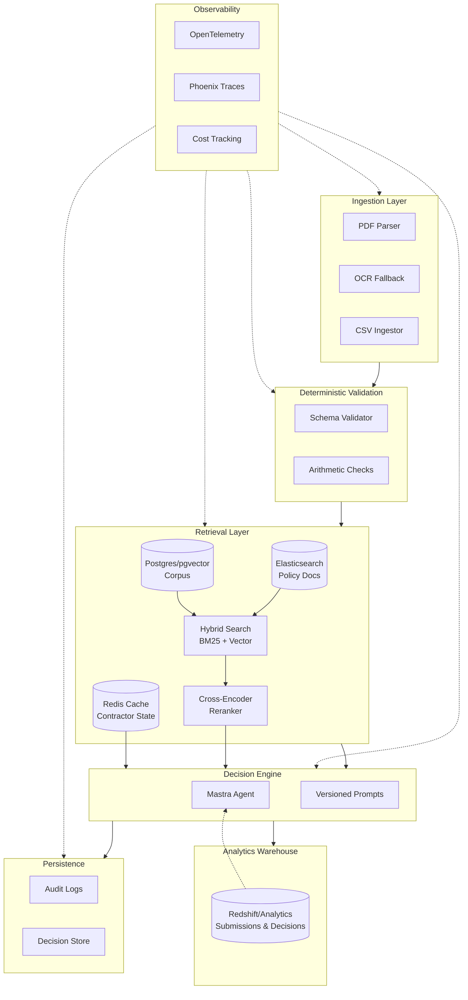

# Tech Stack Implementation Guide

Status Label: Designed / Target

Truth anchors:

- [`../foundation/tech-stack-map.md`](../foundation/tech-stack-map.md)
- [`../foundation/implemented-vs-target.md`](../foundation/implemented-vs-target.md)
- [`../../job.md`](../../job.md)

This guide documents how each technology in the target production stack (from `job.md`) would be implemented in the WCP Compliance Agent, adapted to the payroll compliance domain.

## Target Stack Architecture

## Domain Mapping

| Job.md Target Stack | WCP Compliance Domain Adaptation |
|---|---|
| **Redshift** (analytics warehouse) | Payroll analytics warehouse storing WCP submissions, decisions, audit history, contractor KPIs, and violation trends |
| **Elasticsearch** (transcript search) | Policy document search over DBWD determinations, regulatory guidance, and historical determination letters |
| **Redis-cached CRM state** | Redis-cached contractor/project state including active projects, contractor profiles, and prevailing wage lookups |
| **Postgres / pgvector** | Vector store for DBWD wage determination embeddings with HNSW indexing for similarity search |
| **BM25 + vector hybrid search** | Hybrid retrieval combining keyword search over policy text with semantic search over wage determinations |
| **Cross-encoder reranking** | Reranking wage and policy evidence for a specific worker/role/locality combination |
| **OpenTelemetry** | Distributed tracing across ingest → validate → retrieve → decide → persist pipeline |
| **Phoenix trace inspection** | LLM decision trace inspection for compliance audit and debugging |
| **Prompt versioning & A/B testing** | Versioned compliance decision prompts with per-contractor-org configuration and canary releases |
| **Cost tracking** | Per-submission, per-contractor-org token and latency accounting with budget guardrails |

## Implementation Documents

### Data Layer

1. **[01-warehouse-redshift.md](./01-warehouse-redshift.md)** - Payroll analytics warehouse for reporting and LLM tool queries
2. **[02-search-elasticsearch.md](./02-search-elasticsearch.md)** - Policy and regulatory document search
3. **[03-cache-redis.md](./03-cache-redis.md)** - Contractor and project state caching
4. **[04-vector-pgvector.md](./04-vector-pgvector.md)** - Vector storage for wage determination corpus

### Retrieval & Decision

5. **[05-retrieval-hybrid-rerank.md](./05-retrieval-hybrid-rerank.md)** - Two-stage hybrid search with cross-encoder reranking
6. **[10-entity-data-model.md](./10-entity-data-model.md)** - Core entity abstractions (Contractor, Project, Submission, etc.)

### Operational Infrastructure

7. **[06-observability-otel-phoenix.md](./06-observability-otel-phoenix.md)** - OpenTelemetry tracing and Phoenix inspection
8. **[07-prompt-infrastructure.md](./07-prompt-infrastructure.md)** - Prompt versioning, A/B testing, per-org configuration
9. **[08-cost-tracking.md](./08-cost-tracking.md)** - Per-submission cost and latency accounting
10. **[09-evaluation-ci.md](./09-evaluation-ci.md)** - CI-based evaluation frameworks and regression detection

## Reading Order

**For recruiters/hiring managers**: Read this INDEX for architecture overview, then jump to any specific tech of interest.

**For implementation planning**:
1. Start with [10-entity-data-model.md](./10-entity-data-model.md) - defines the domain model
2. Then [01-warehouse-redshift.md](./01-warehouse-redshift.md) through [04-vector-pgvector.md](./04-vector-pgvector.md) - data foundations
3. Then [05-retrieval-hybrid-rerank.md](./05-retrieval-hybrid-rerank.md) - retrieval pipeline
4. Then [06-observability-otel-phoenix.md](./06-observability-otel-phoenix.md) through [09-evaluation-ci.md](./09-evaluation-ci.md) - operational controls

## Implementation Phasing

### Phase 1: Data Foundations
- Entity data model (PostgreSQL)
- Warehouse schema (Redshift)
- Redis cache for contractor state
- Elasticsearch index setup

### Phase 2: Retrieval Pipeline
- pgvector corpus storage
- Hybrid search implementation
- Cross-encoder reranking
- Policy document search integration

### Phase 3: Operational Controls
- OpenTelemetry instrumentation
- Cost tracking service
- Prompt registry and versioning
- CI-based evaluation framework

### Phase 4: Production Hardening
- Phoenix trace inspection UI
- A/B testing infrastructure
- Advanced evaluation datasets
- Performance optimization

## Integration Points

All implementation docs reference integration with existing repo files:

- `src/mastra/tools/` - new retrieval and warehouse tools
- `src/entrypoints/` - orchestration integration
- `src/types/` - entity types
- `src/instrumentation.ts` - observability hooks

## Trade-offs Summary

| Layer | Choice | Alternatives Considered | Why This |
|---|---|---|---|
| Warehouse | Redshift/BigQuery | ClickHouse, Druid | SQL-native, team familiarity, BI ecosystem |
| Search | Elasticsearch | Meilisearch, Typesense | Hybrid search maturity, policy-scale |
| Cache | Redis | Memcached, Valkey | Rich data structures, pub/sub invalidation |
| Vector | Postgres/pgvector | Pinecone, Weaviate | Operational simplicity, colocation with relational |
| Rerank | Cross-encoder | MonoT5, pointwise | Balance of quality and latency |
| Tracing | OTel + Phoenix | LangSmith, Langfuse | Vendor-neutral, self-hostable, compliance-friendly |
| Prompts | DB + code | Unstructured, PromptLayer | Version control + runtime flexibility |

## Honest Assessment

This documentation represents the **target architecture**, not current implementation. The existing repo implements a minimal slice to prove architectural thinking. These docs provide the roadmap for evolving to a production-grade compliance platform.

The compliance domain forces good infrastructure instincts:
- Deterministic validation before LLM reasoning
- Citation requirements drive retrieval quality
- Audit obligations mandate traceability
- False approvals more dangerous than deferrals

This same infrastructure pattern generalizes to revenue intelligence and other regulated domains.
