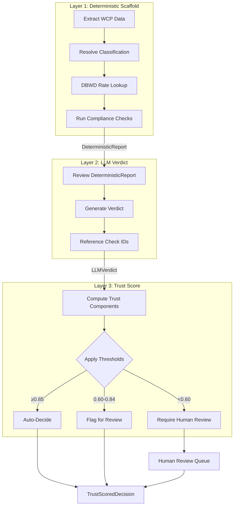
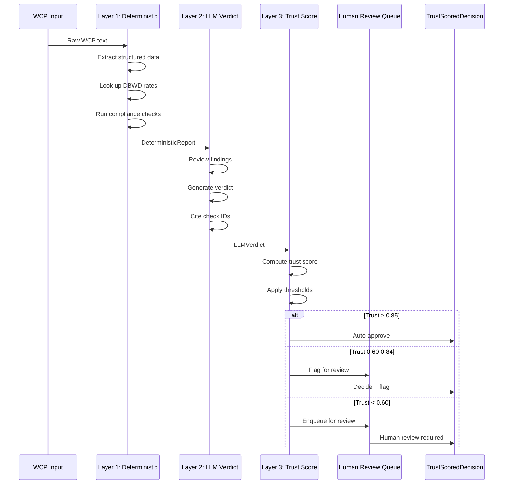

# Decision Architecture Doctrine

Status Label: Implemented

How the WCP Compliance Agent enforces a **three-layer decision pipeline** to ensure regulatory compliance, auditability, and trustworthiness.

---

## The Doctrine

Every compliance decision (Approved/Revise/Reject) MUST flow through three sequential layers:

```
┌─────────────────────────────────────────────────────────────────────┐
│ LAYER 1 — DETERMINISTIC SCAFFOLD (Deterministic, Replay-Safe)       │
│  - Extract structured fields from WCP input (regex/parsers)         │
│  - Look up DBWD rates from authoritative source (SAM.gov)             │
│  - Run rule checks: prevailing wage, overtime (1.5×), fringe, class.  │
│  - Output: DeterministicReport with every check + citation + source │
│  - NO AI. Pure code. 100% reproducible.                             │
└─────────────────────────────────────────────────────────────────────┘
                              │
                              ▼
┌─────────────────────────────────────────────────────────────────────┐
│ LAYER 2 — LLM VERDICT (Reasoning Only, No Math)                       │
│  - Input: DeterministicReport + regulatory context                  │
│  - LLM must reference Layer 1 findings; FORBIDDEN from recomputing  │
│  - Output: LLMVerdict { status, rationale, referencedCheckIds[] }   │
│  - Reasoning trace captured verbatim for audit                        │
└─────────────────────────────────────────────────────────────────────┘
                              │
                              ▼
┌─────────────────────────────────────────────────────────────────────┐
│ LAYER 3 — TRUST SCORE + HUMAN REVIEW (Governance)                   │
│  - Compute hybrid trust score (see formula below)                   │
│  - Apply thresholds: auto | flag | require_human                   │
│  - Enqueue low-trust cases for human review                         │
│  - Output: TrustScoredDecision with full audit trail                │
└─────────────────────────────────────────────────────────────────────┘
```

**The only way** to produce a `WCPDecision` is via this pipeline. Bypassing any layer is a bug and will fail CI.

### Visual Diagram (Mermaid)



### Sequence Diagram



---

## Layer 1: Deterministic Scaffold

### Responsibility
Produce an **objective, verifiable fact base** about the WCP submission.

### What It Does
| Task | Implementation | Regulation |
|------|---------------|------------|
| Extract structured data | `extractWCPTool` — regex/parsers | 29 CFR 5.5(a)(3)(ii) |
| Look up DBWD rates | Vector DB + exact match | 40 U.S.C. § 3142(a) |
| Validate prevailing wage | Exact comparison: reported ≥ DBWD.base | 40 U.S.C. § 3142(a) |
| Validate overtime | 1.5× base rate for hours > 40 | 40 U.S.C. § 3702 |
| Validate fringe | reportedFringe ≥ DBWD.fringe | 29 CFR 5.22 |
| Resolve classification | Hybrid: exact → alias → semantic | 29 CFR 5.5(a)(3)(i) |

### Output: DeterministicReport
```typescript
interface DeterministicReport {
  traceId: string;                    // Unique decision identifier
  dbwdVersion: string;                 // SAM.gov version/date
  extracted: ExtractedWCP;            // Role, hours, wages, etc.
  checks: CheckResult[];               // Every rule check performed
  classificationConfidence: number;    // 0-1 from tier used
  deterministicScore: number;          // 0-1 fraction of checks that ran cleanly
  timings: { stage: string; ms: number }[];
}

interface CheckResult {
  id: string;                        // e.g., "base_wage_check_001"
  type: "wage" | "overtime" | "fringe" | "classification";
  passed: boolean;
  regulation: string;                  // "40 U.S.C. § 3142(a)"
  expected: number;
  actual: number;
  difference?: number;
  severity: "info" | "warning" | "error" | "critical";
}
```

### Forbidden in Layer 1
- LLM calls
- Fuzzy matching without confidence scores
- Estimation or approximation
- Any non-reproducible computation

---

## Layer 2: LLM Verdict

### Responsibility
Apply **regulatory reasoning** over the deterministic fact base.

### What It Does
- Reviews `DeterministicReport.checks[]`
- Decides: **Approved** (no issues), **Revise** (minor fixes), **Reject** (major violations)
- Provides human-readable rationale
- Cites specific regulations

### Input Contract
```typescript
interface LLMInput {
  report: DeterministicReport;
  regulatoryContext: string;           // Brief summary of Davis-Bacon requirements
  instructions: string;              // "You MUST reference check IDs. You MUST NOT recompute."
}
```

### Output: LLMVerdict
```typescript
interface LLMVerdict {
  traceId: string;                   // Same as report.traceId
  status: "Approved" | "Revise" | "Reject";
  rationale: string;                   // Human-readable justification
  referencedCheckIds: string[];        // MUST be non-empty subset of report.checks[].id
  citations: RegulatoryCitation[];
  selfConfidence: number;              // 0-1 (LLM's own assessment)
  reasoningTrace: string;              // Full chain-of-thought or structured steps
  tokenUsage: number;
}

interface RegulatoryCitation {
  statute: string;                     // "40 U.S.C. § 3142(a)"
  description: string;
  dbwdId?: string;
}
```

### Enforcement: Cannot Recompute
The LLM prompt includes:
```
You are reviewing a pre-computed compliance report.
DO NOT recalculate wages, overtime, or fringe benefits.
DO NOT lookup DBWD rates yourself.
Use ONLY the findings in the provided DeterministicReport.
For every claim in your rationale, cite the check ID from the report.
```

**Schema validation**: `referencedCheckIds` must be non-empty and all IDs must exist in the input report. Runtime validation rejects verdicts that don't ground their claims.

### Agreement Check
Layer 3 compares `verdict.status` against the severity of `report.checks[]`:
- If checks contain "critical" errors and verdict is "Approved" → agreement score = 0
- If checks all pass and verdict is "Approved" → agreement score = 1
- Partial matches scored proportionally

Any **disagreement** forces `humanReview.required = true` regardless of trust score.

---

## Layer 3: Trust Score + Human Review

### Responsibility
**Govern** the decision: compute confidence, apply thresholds, flag for human review.

### Trust Score Formula

```
trust = 0.35 × deterministicScore
      + 0.25 × classificationConfidence
      + 0.20 × llmSelfConfidence
      + 0.20 × agreementScore
```

| Component | Weight | Source |
|-----------|--------|--------|
| `deterministicScore` | 35% | Layer 1: fraction of checks that ran cleanly |
| `classificationConfidence` | 25% | Layer 1: exact (1.0) / alias (0.9) / semantic (0.7) |
| `llmSelfConfidence` | 20% | Layer 2: model's self-reported confidence |
| `agreementScore` | 20% | Layer 3: verdict.status aligns with check severities |

### Thresholds

| Trust Range | Band | Action |
|-------------|------|--------|
| `0.85 - 1.00` | **auto** | Auto-decide, no human review |
| `0.60 - 0.84` | **flag_for_review** | Decide but flag for optional human review |
| `0.00 - 0.59` | **require_human** | Block auto-approval, require human review |

**Override rule**: Any LLM/deterministic disagreement forces `require_human` regardless of trust score.

### Human Review Queue

```typescript
interface HumanReviewQueue {
  enqueue(decision: TrustScoredDecision): void;
  listPending(): TrustScoredDecision[];
  markReviewed(
    traceId: string,
    status: "approved" | "rejected",
    reviewer: string,
    notes?: string
  ): void;
}
```

**Stub implementation** (Phase 01): In-memory queue with JSON-file persistence.  
**Production implementation** (Phase 02): PostgreSQL table with 7-year retention.

### Output: TrustScoredDecision
```typescript
interface TrustScoredDecision {
  traceId: string;
  deterministic: DeterministicReport;
  verdict: LLMVerdict;
  trust: {
    score: number;
    components: {
      deterministic: number;
      classification: number;
      llmSelf: number;
      agreement: number;
    };
    band: "auto" | "flag_for_review" | "require_human";
    reasons: string[];              // Why this band was selected
  };
  humanReview: {
    required: boolean;
    status: "not_required" | "pending" | "approved" | "rejected";
    queuedAt?: string;            // ISO timestamp
    reviewedAt?: string;
    reviewer?: string;
    notes?: string;
  };
  auditTrail: AuditEvent[];         // Append-only log of every stage
  finalStatus: "Approved" | "Revise" | "Reject" | "Pending Human Review";
}
```

---

## Correct vs Incorrect Code

### ✅ Correct: Layered Pipeline

```typescript
// src/pipeline/orchestrator.ts
export async function generateWcpDecision(input: WCPInput): Promise<TrustScoredDecision> {
  // Layer 1: Deterministic scaffold
  const report = await layer1Deterministic(input);
  
  // Layer 2: LLM verdict (reasoning only)
  const verdict = await layer2LLMVerdict(report);
  
  // Layer 3: Trust score + human review
  const decision = await layer3TrustScore(report, verdict);
  
  if (decision.trust.band === "require_human") {
    await humanReviewQueue.enqueue(decision);
  }
  
  return decision; // ONLY TrustScoredDecision can be returned
}
```

### ❌ Incorrect: Bypassing Layers

```typescript
// DON'T DO THIS
export async function badDecision(input: WCPInput): Promise<WCPDecision> {
  const agent = new Agent({
    instructions: "Check if this WCP is compliant..." // Vague, no deterministic context
  });
  
  // Layer 1 skipped! LLM does extraction + validation itself.
  const result = await agent.generate(input);
  
  // No trust score computed
  // No human review flagging
  return result; // Wrong type, no audit trail
}
```

**CI gate will catch this**: `npm run lint:pipeline` fails if `Agent.generate()` is called outside `layer2-llm-verdict.ts`.

---

## Audit Trail

Every `TrustScoredDecision` includes a complete, replayable audit trail:

```typescript
interface AuditEvent {
  timestamp: string;          // ISO 8601
  stage: "layer1" | "layer2" | "layer3" | "human_review";
  event: string;             // "check_completed", "llm_reasoning", "trust_computed", "enqueued"
  details: Record<string, unknown>;
  hash?: string;             // Optional: content hash for tamper detection
}
```

### Replay Capability
```typescript
// Replay a decision by traceId
const original = await loadDecision(traceId);
const replayed = await generateWcpDecision({
  content: original.deterministic.extracted.rawInput,
  dbwdVersion: original.deterministic.dbwdVersion // Use same DBWD version!
});

// Verify: deterministic layers must produce identical results
assert(replayed.deterministic.checks === original.deterministic.checks);
```

**Copeland Act compliance**: Full record of how each decision was made, including LLM reasoning.

---

## Integration with Compliance Documentation

This architecture directly implements:

| Regulation | Layer | Implementation |
|------------|-------|----------------|
| **40 U.S.C. § 3142** (prevailing wage) | Layer 1 | `validatePrevailingWage()` deterministic check |
| **40 U.S.C. § 3702** (overtime) | Layer 1 | `validateOvertime()` with 1.5× base rate |
| **29 CFR 5.22** (fringe benefits) | Layer 1 | `validateFringeBenefits()` |
| **29 CFR 5.5(a)(3)(i)** (classification) | Layer 1 | Hybrid classification with confidence |
| **Copeland Act § 3145** (record keeping) | Layer 3 | Full audit trail + 7-year retention |
| **Audit trail requirements** | All | `traceId` links every stage; replayable |

---

## Developer Guidelines

### Adding a New Check

1. **Add to Layer 1**: Implement deterministic check in `layer1-deterministic.ts`
2. **Update schema**: Add new check type to `DeterministicReport.checks[]`
3. **Regulatory citation**: Include statute reference in check output
4. **Test**: Unit test the check; add to golden set
5. **Layer 2**: LLM automatically sees new check via report
6. **Trust weights**: If new check is critical, adjust trust formula weights (document rationale in ADR)

### Changing Trust Formula

1. **Update docs**: Modify `trust-scoring.md` and this document
2. **Update code**: `layer3-trust-score.ts`
3. **Recalibrate**: Run `npm run test:trust-calibration` against golden set
4. **ADR amendment**: Document weight change rationale

### Bypassing Human Review (Emergency)

**Don't.** If you believe a case shouldn't require human review despite low trust:
1. Improve Layer 1 check quality
2. Tune trust formula weights
3. Add specific case to golden set for calibration

**Never** short-circuit the queue in production code.

---

## Related Documents

- `docs/adrs/ADR-005-decision-architecture.md` — Original decision record
- `docs/architecture/trust-scoring.md` — Trust formula and calibration
- `docs/architecture/human-review-workflow.md` — Queue and reviewer UX
- `src/types/decision-pipeline.ts` — Typed contracts (source of truth)
- `docs/compliance/traceability-matrix.md` — Regulation-to-code mapping
- `docs/compliance/implementation-guide.md` — "Three-Layer Pattern" section

---

## Enforcement Checklist

Before any code merge:
- [ ] All deterministic checks have regulation citations
- [ ] LLM verdict includes `referencedCheckIds` (non-empty, valid)
- [ ] Trust score computed for every decision
- [ ] Low-trust cases (`<0.60`) enqueued for human review
- [ ] Audit trail includes all three stages
- [ ] `npm run lint:pipeline` passes
- [ ] `npm run test:trust-calibration` passes
- [ ] ADR updated if trust weights changed
